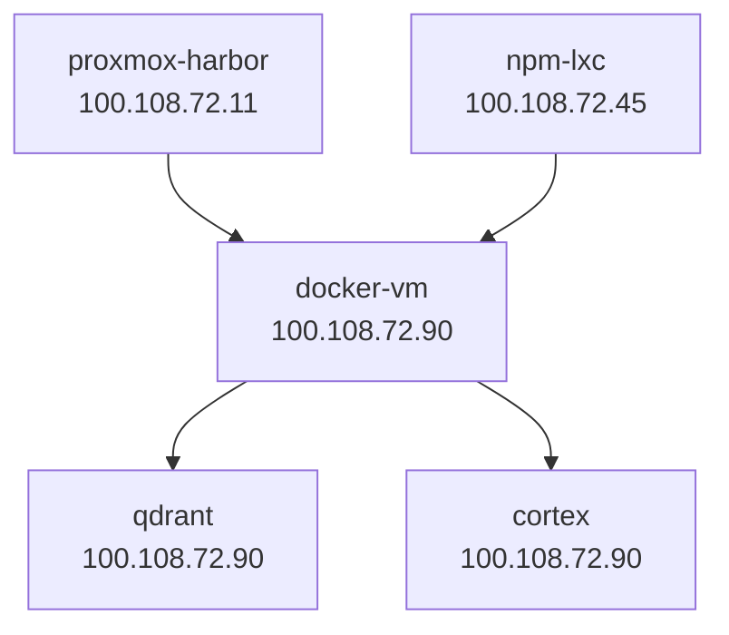

# Tailscale Network Manager

## Overview

This skill provides Tailscale network management operations:
1. **Device monitoring**: List all Tailscale devices and their IPs
2. **Zombie detection**: Find unused or offline devices
3. **ACL management**: Update Tailscale access control lists
4. **Network topology**: Visualize Tailscale network connections
5. **NPM coordination**: Detect IP drift for proxy hosts

## Token Savings

- **No MCP needed**: Uses Tailscale CLI directly
- **Lightweight**: Shell scripts and JSON parsing only

---

## What This Skill Does

Manage Tailscale network operations:
1. List all devices and their current IPs
2. Detect zombie devices (not seen in 30+ days)
3. Update Tailscale ACLs programmatically
4. Monitor network health and connectivity
5. Coordinate with NPM for IP drift detection

## Tailscale Environment

**Network:**
- Network: `aienablement.academy` tailnet
- Devices: 8 active devices
- Admin Console: https://login.tailscale.com/admin/machines

**Key Devices:**
- `proxmox-harbor` - 100.108.72.11 (Proxmox host)
- `docker-vm` - 100.108.72.90 (Main Docker host)
- `npm-lxc` - 100.108.72.45 (Nginx Proxy Manager)
- `qdrant` - 100.108.72.90 (Vector DB)
- `cortex` - 100.108.72.90 (Knowledge base)

---

## Quick Reference

### List All Devices

```bash
tailscale status --json | jq -r '.Peer[] | "\(.HostName)\t\(.TailscaleIPs[0])\t\(.OS)\t\(.LastSeen)"'
```

**Human-readable:**
```bash
tailscale status
```

### Get Current Device IP

```bash
tailscale ip -4
```

### Get Device by Hostname

```bash
HOSTNAME="docker-vm"
tailscale status --json | jq -r ".Peer[] | select(.HostName == \"$HOSTNAME\") | .TailscaleIPs[0]"
```

### Check Tailscale Status

```bash
tailscale status --self
```

---

## Common Operations

### List Devices with Details

```bash
tailscale status --json | jq -r '
  .Peer[] |
  [
    .HostName,
    .TailscaleIPs[0],
    .OS,
    (.LastSeen | split("T")[0]),
    (if .Online then "Online" else "Offline" end)
  ] | @tsv
' | column -t -s $'\t'
```

**Output:**
```
docker-vm       100.108.72.90   linux    2025-12-06  Online
proxmox-harbor  100.108.72.11   linux    2025-12-06  Online
npm-lxc         100.108.72.45   linux    2025-12-06  Online
...
```

### Find Zombie Devices (Not Seen in 30+ Days)

```bash
THIRTY_DAYS_AGO=$(date -d "30 days ago" --iso-8601)

tailscale status --json | jq -r "
  .Peer[] |
  select(.LastSeen < \"$THIRTY_DAYS_AGO\") |
  [.HostName, .TailscaleIPs[0], .LastSeen] | @tsv
" | column -t
```

### Remove Device (via Admin Console)

```bash
# Get device ID
DEVICE_ID=$(tailscale status --json | jq -r ".Peer[] | select(.HostName == \"old-device\") | .ID")

# Remove via tailscale CLI (requires auth)
tailscale logout --device-id "$DEVICE_ID"
```

**Note:** Permanent removal requires admin console access.

### Ping All Devices

```bash
tailscale status --json | jq -r '.Peer[].TailscaleIPs[0]' | while read IP; do
  echo -n "$IP: "
  ping -c 1 -W 1 "$IP" &>/dev/null && echo "OK" || echo "FAILED"
done
```

---

## ACL Management

### Get Current ACL

```bash
tailscale acl get > /tmp/tailscale-acl.json
```

### Validate ACL

```bash
tailscale acl validate /tmp/tailscale-acl.json
```

### Update ACL

```bash
tailscale acl set /tmp/tailscale-acl.json
```

### Example ACL Structure

```json
{
  "acls": [
    {
      "action": "accept",
      "src": ["autogroup:admin"],
      "dst": ["*:*"]
    },
    {
      "action": "accept",
      "src": ["tag:docker"],
      "dst": ["tag:services:80,443,3000-9000"]
    }
  ],
  "tagOwners": {
    "tag:docker": ["autogroup:admin"],
    "tag:services": ["autogroup:admin"]
  }
}
```

---

## Network Topology Visualization

### Generate Mermaid Diagram

```bash
echo "graph TD"
tailscale status --json | jq -r '
  .Peer[] |
  "    \(.HostName)[\(.HostName)<br/>\(.TailscaleIPs[0])]"
'
echo "    proxmox-harbor --> docker-vm"
echo "    docker-vm --> qdrant"
echo "    docker-vm --> cortex"
echo "    npm-lxc --> docker-vm"
```

**Output (Mermaid):**


---

## NPM Integration (IP Drift Detection)

### Problem
NPM proxy hosts point to Tailscale IPs. When services move, IPs change, breaking proxies.

### Solution
Use `tailscale-device-audit.sh` to:
1. Get current Tailscale IPs for all devices
2. Compare with NPM proxy backend IPs
3. Report mismatches
4. Trigger NPM IP update

### Example Workflow

```bash
# 1. Get Tailscale IPs
bash /Users/adamkovacs/Documents/codebuild/infrastructure-ops/scripts/networking/tailscale-device-audit.sh

# 2. Compare with NPM
bash /Users/adamkovacs/Documents/codebuild/infrastructure-ops/scripts/networking/npm-fix-ips.sh

# 3. Review and apply fixes
```

---

## Helper Scripts

All scripts located in: `/Users/adamkovacs/Documents/codebuild/infrastructure-ops/scripts/networking/`

### tailscale-device-audit.sh
Audit all Tailscale devices, detect zombies, check connectivity.

**Usage:**
```bash
bash tailscale-device-audit.sh
```

**Output:**
```
=== Tailscale Device Audit ===
Total devices: 8
Online: 6
Offline: 2

=== Zombie Devices (not seen in 30+ days) ===
old-macbook    100.108.72.50    2025-10-15

=== Connectivity Test ===
100.108.72.90  docker-vm       OK
100.108.72.11  proxmox-harbor  OK
100.108.72.45  npm-lxc         FAILED
```

### tailscale-acl-update.sh
Update Tailscale ACLs with validation.

**Usage:**
```bash
bash tailscale-acl-update.sh /path/to/new-acl.json
```

**What it does:**
1. Backup current ACL
2. Validate new ACL
3. Apply new ACL
4. Verify application

---

## Troubleshooting

### Issue: Device Not Showing Up
**Symptoms**: `tailscale status` doesn't show expected device
**Cause**: Device not connected to tailnet
**Solution**:
1. Check Tailscale is running: `systemctl status tailscaled`
2. Check auth: `tailscale status --self`
3. Re-authenticate: `tailscale up`

### Issue: Cannot Ping Device
**Symptoms**: Tailscale shows device online, but ping fails
**Cause**: Firewall blocking ICMP or Tailscale traffic
**Solution**:
1. Check firewall: `iptables -L -n | grep 100.`
2. Allow Tailscale: `iptables -I INPUT -i tailscale0 -j ACCEPT`
3. Check Tailscale routes: `tailscale status --peers`

### Issue: ACL Update Rejected
**Symptoms**: `tailscale acl set` returns validation error
**Cause**: ACL syntax error or invalid permissions
**Solution**:
1. Validate locally: `tailscale acl validate /tmp/acl.json`
2. Check syntax: https://tailscale.com/kb/1018/acls
3. Review error message for specific issue

### Issue: IP Changed After Service Restart
**Symptoms**: Service has different IP after Docker restart
**Cause**: Tailscale container restarted, got new IP
**Solution**: Use Tailscale device tags for stable addressing, or set static IPs

---

## Monitoring and Alerts

### Daily Health Check

Run via hook: `.claude/hooks/tailscale-health-check.sh`

**Checks:**
1. All critical devices online
2. No zombie devices
3. Connectivity to all devices
4. ACL compliance

### Alert on Device Down

```bash
CRITICAL_DEVICES=("docker-vm" "npm-lxc" "proxmox-harbor")

for DEVICE in "${CRITICAL_DEVICES[@]}"; do
  STATUS=$(tailscale status --json | jq -r ".Peer[] | select(.HostName == \"$DEVICE\") | .Online")
  if [ "$STATUS" != "true" ]; then
    echo "ALERT: $DEVICE is offline!"
    # Send notification (Slack, email, etc.)
  fi
done
```

---

## Integration with Other Skills

**NPM Proxy Manager:**
- Detects IP drift for NPM backends
- Coordinates IP updates
- Related: `../npm-proxy-manager/skill.md`

**SSL Certificate Manager:**
- Monitors SSL for Tailscale-backed services
- Related: `../ssl-certificate-manager/skill.md`

---

## Related Documentation

- Tailscale Docs: https://tailscale.com/kb/
- ACL Documentation: https://tailscale.com/kb/1018/acls
- Admin Console: https://login.tailscale.com/admin
- Infrastructure Ops Scripts: `/Users/adamkovacs/Documents/codebuild/infrastructure-ops/scripts/networking/`
