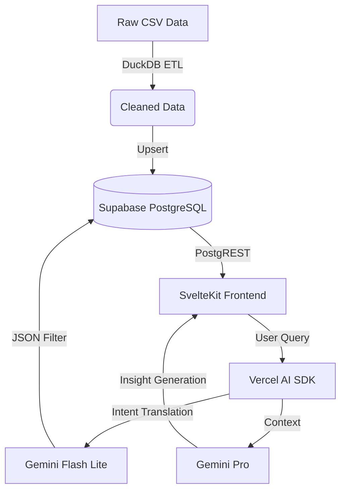

# 🚀 RPLS Intelligence Platform


> **The Labor Market, Decoded.**
> A next-generation research platform that transforms static CSV dumps into a real-time, queryable, and AI-augmented intelligence engine.

---

## 🧠 The Philosophy
We don't just visualize data; we **reason** about it.
This platform combines **Deterministic Data Engineering** (DuckDB/Polars) with **Probabilistic AI** (Gemini Flash) to deliver insights that are both accurate and explanatory.

### Architecture


---

## ⚡ Key Features

### 📊 Core Dashboard
- **Real-Time Trends:** Employment, Layoffs, and Salary data updated instantly via ETL.
- **Dynamic Filtering:** Slice data by Sector, State, and Occupation.
- **Sector Spotlight:** Compare industry performance (Hiring vs. Attrition).

### 🤖 Native AI Integration
- **Natural Language Querying:** Ask *"Show me construction layoffs in Texas"* and watch the dashboard update.
- **Automated Insights:** Click "Analyze" to get a Gemini-powered summary of the current view.
- **Guardrails:** All AI outputs are strictly validated via Zod schemas—no hallucinated SQL.

---

## 🛠️ Tech Stack

| Component | Technology | Role |
|-----------|------------|------|
| **Frontend** | [SvelteKit](https://kit.svelte.dev/) | UI & Server-Side Rendering |
| **Database** | [Supabase](https://supabase.com/) | PostgreSQL, Auth, Vector Search |
| **ETL** | [DuckDB](https://duckdb.org/) + Python | High-performance Data Ingestion |
| **AI** | [Google Gemini](https://deepmind.google/technologies/gemini/) | 2.5 Flash Lite (Speed) & 1.5 Pro (Reasoning) |
| **Styling** | Tailwind CSS | Utility-first design |

---

## 🚀 Quick Start

### Prerequisites
- Node.js 20+
- Python 3.10+
- Supabase Account
- Google Cloud Project (Vertex AI or Gemini API)

### 1. Clone & Install
```bash
git clone https://github.com/OPEN-Talent-Society/rpls-dashboard.git
cd rpls-dashboard
npm install
```

### 2. Setup Environment
Copy the template and fill in your keys:
```bash
cp .env.example .env
# Edit .env with your Supabase & Gemini credentials
```

### 3. Run the Data Pipeline
Initialize your database and load the data:
```bash
# 1. Create Tables (Copy content of supabase/schema.sql to Supabase SQL Editor)
# 2. Run ETL
cd backend
pip install -r requirements_etl.txt
python etl_supabase.py
```

### 4. Launch the App
```bash
cd ..
npm run dev
```
Visit `http://localhost:5173` to see the platform in action.

---

## 🛡️ Spec-Driven Development
This project follows **Spec-Driven Development (SDD)**.
- **`.spec/constitution.md`**: Core architectural rules.
- **`.spec/v1/prd.md`**: Product requirements.
- **`.spec/v1/openapi.yaml`**: API Contracts.
- Additional spec files: `.spec/v1/plan.md`, `.spec/v1/tasks.md`, `.spec/v1/ai_architecture.md`, `.spec/v1/design_system.md`.
- Legacy docs (for reference): `docs/spec.md`, `docs/TECHNICAL_SPECS.md`, `docs/DATA_ARCHITECTURE.md`. Prefer `.spec/` as the source of truth.

Always update the specs *before* writing code.

---

## 📄 License
MIT © [Open Talent Society](https://opentalentsociety.org)
