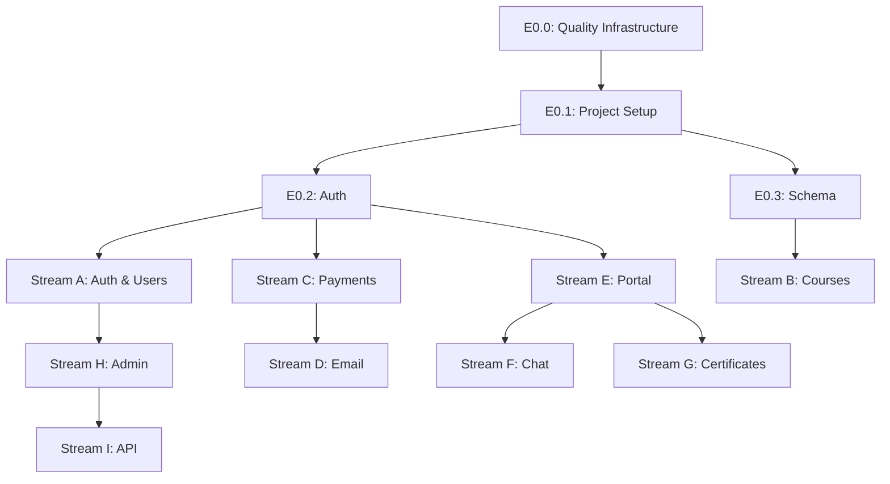

# 6. Epics and Implementation Phases

## 6.1 Phase Overview

The AI Enablement Academy v2 platform will be delivered across 5 major phases spanning 12+ weeks, organized into 9 parallel development streams to maximize team velocity while maintaining architectural coherence.

| Phase | Name | Duration | Focus | Key Deliverables |
|-------|------|----------|-------|------------------|
| 0 | Foundation | Week 1-2 | Project setup, auth, schema | Dev environment, auth system, database |
| 1 | Core MVP | Week 3-6 | B2C purchase, learner portal | Public site, payments, learner access |
| 2 | Post-Cohort | Week 7-8 | Recordings, chatbot, certificates | Content delivery, AI support, credentials |
| 3 | B2B & Admin | Week 9-11 | Organizations, admin dashboard | Enterprise features, management tools |
| 4 | Platform API | Week 12+ | API, MCP, webhooks | Developer platform, integrations |

### Phase Characteristics

**Phase 0: Foundation (Critical Path)**
- Single-threaded to establish architectural baseline
- All subsequent work depends on this foundation
- No production deployment until Phase 1

**Phase 1: Core MVP (Parallel Execution)**
- First public release candidate
- Multiple teams can work independently
- Marketing, payments, and portal streams diverge

**Phase 2: Post-Cohort (Value Add)**
- Enhances Phase 1 MVP with retention features
- Can ship iteratively as features complete
- No blocking dependencies between epics

**Phase 3: B2B & Admin (Revenue Expansion)**
- Unlocks enterprise market segment
- Admin tools enable operational scale
- Parallel to Phase 2 completion

**Phase 4: Platform API (Ecosystem)**
- Developer-facing capabilities
- Enables partner integrations
- Ongoing expansion beyond v2

---

## 6.2 Epic Definitions

### Phase 0: Foundation

#### E0.0 - Quality Infrastructure Setup
**Owner:** Engineering
**Duration:** 1 day
**Priority:** P0 - Blocking

**User Story:**
> As a developer, I need quality infrastructure and accessibility tooling in place so that we maintain high standards from day one.

**Technical Scope:**
- Configure Lighthouse CI in GitHub Actions workflow
- Integrate axe-core into Jest test suite for component accessibility testing
- Add Playwright accessibility tests for E2E validation
- Define performance budgets in next.config.js (bundle size limits)
- Document WCAG 2.2 AA compliance checklist for the team
- Setup mobile-first Tailwind configuration with accessibility utilities
- Enable eslint-plugin-jsx-a11y for automated accessibility linting
- Configure proper semantic HTML defaults in component templates

**Acceptance Criteria:**
- [ ] Lighthouse CI configured in GitHub Actions
- [ ] axe-core integrated into test suite
- [ ] Performance budgets defined in next.config.js
- [ ] WCAG 2.2 AA checklist documented
- [ ] Mobile-first Tailwind config set up
- [ ] Accessibility linting (eslint-plugin-jsx-a11y) enabled
- [ ] All CI checks passing on pull requests
- [ ] Accessibility documentation available in /docs

**Dependencies:** None (first task)
**Risks:** None (foundational setup)

**Tasks:**
| Task | Hours | Notes |
|------|-------|-------|
| Configure Lighthouse CI | 2 | GitHub Actions workflow |
| Add axe-core to Jest | 1 | Component testing |
| Add Playwright a11y tests | 2 | E2E accessibility |
| Configure performance budgets | 1 | Bundle size limits |
| Setup eslint-plugin-jsx-a11y | 0.5 | Linting rules |
| Document a11y checklist | 1.5 | Team reference |

**Quality Standards:**
- Lighthouse scores: Performance >90, Accessibility 100, Best Practices 100, SEO 100
- Bundle size limits: First Load JS < 200KB, Core Web Vitals: LCP < 2.5s, CLS < 0.1
- Accessibility: WCAG 2.2 Level AA compliance, keyboard navigation support, ARIA labels
- Testing: 100% of UI components tested with axe-core, E2E flows validated with Playwright

---

#### E0.1 - Project Setup
**Owner:** Tech Lead
**Duration:** 2 days
**Priority:** P0 - Blocking

**User Story:**
> As a developer, I need a fully configured Next.js 15 project so that I can begin feature development with all tooling in place.

**Technical Scope:**
- Initialize Next.js 15 with App Router and TypeScript
- Configure pnpm workspace with proper package.json
- Setup Convex project with dev/staging/prod environments
- Install and configure shadcn/ui with custom theme
- Configure Vercel deployment with preview branches
- Setup environment variables (.env.local, .env.example)
- Configure ESLint, Prettier, and Husky pre-commit hooks
- Create development documentation (README, CONTRIBUTING)

**Acceptance Criteria:**
- [ ] `pnpm dev` starts local development server
- [ ] `pnpm build` completes without errors
- [ ] Convex functions deploy to dev environment
- [ ] shadcn/ui components render correctly
- [ ] Vercel preview deployment succeeds
- [ ] All environment variables documented

**Dependencies:** E0.0 (Quality Infrastructure Setup)
**Risks:** None (greenfield)

---

#### E0.2 - Authentication
**Owner:** Backend Lead
**Duration:** 3 days
**Priority:** P0 - Blocking

**User Story:**
> As a user, I need to securely authenticate using Google OAuth or magic link so that I can access the platform.

**Technical Scope:**
- Implement Convex Auth with email/password foundation
- Configure Google OAuth provider with consent screen
- Configure magic link provider with rate limiting
- Implement user creation callback (creates users table record)
- Build auth UI components (SignIn, SignUp, SignOut buttons)
- Create protected route middleware for App Router
- Setup session management with Convex sessions
- Implement auth state hooks (useCurrentUser)

**Acceptance Criteria:**
- [ ] Users can sign in with Google OAuth
- [ ] Users can sign in with magic link email
- [ ] New users automatically created in database
- [ ] Protected routes redirect to /sign-in
- [ ] Session persists across page refreshes
- [ ] Sign out clears session correctly
- [ ] Auth UI follows design system

**Dependencies:** E0.1 (Project Setup)
**Risks:** OAuth consent screen approval (1-3 days)

**Security Considerations:**
- CSRF protection enabled
- Magic link expiry: 15 minutes
- Rate limiting: 5 requests per email per hour
- Session expiry: 30 days with sliding window

---

#### E0.3 - Database Schema
**Owner:** Backend Lead
**Duration:** 3 days
**Priority:** P0 - Blocking

**User Story:**
> As a developer, I need a complete database schema so that I can implement business logic with proper data models.

**Technical Scope:**
- Implement all 18 tables in Convex schema:
  - **Core:** users, courses, cohorts, enrollments
  - **Content:** recordings, enablementKits, certificates
  - **Commerce:** payments, refunds, waitlistEntries
  - **B2B:** organizations, organizationMembers, invites
  - **Engagement:** conversations, messages, officeHourBookings
  - **Platform:** apiKeys, webhookSubscriptions, auditLog
- Create indexes for all query patterns:
  - Enrollment lookup by user/cohort
  - Cohort filtering by course/status
  - Organization member lookups
  - Conversation history by user
- Create seed data scripts for development
- Implement schema validation functions
- Document all table relationships

**Acceptance Criteria:**
- [ ] All 18 tables defined with correct fields
- [ ] All indexes created for query optimization
- [ ] Seed data populates sample courses/cohorts
- [ ] Schema validation functions pass tests
- [ ] ERD documentation generated
- [ ] Migration path documented

**Dependencies:** E0.1 (Project Setup)
**Risks:** Schema changes require data migration in production

**Data Model Highlights:**
```typescript
// Example: enrollments table with all relationships
enrollments: defineTable({
  userId: v.id("users"),
  cohortId: v.id("cohorts"),
  status: v.union(v.literal("active"), v.literal("completed"), v.literal("cancelled")),
  purchaseDate: v.number(),
  completionDate: v.optional(v.number()),
  paymentId: v.id("payments"),
  certificateId: v.optional(v.id("certificates")),
})
  .index("by_user", ["userId"])
  .index("by_cohort", ["cohortId"])
  .index("by_status", ["status"])
  .index("by_user_cohort", ["userId", "cohortId"])
```

---

### Phase 1: Core MVP

#### E1.0 - Performance & Mobile Optimization
**Owner:** Engineering
**Duration:** Ongoing (built into each sprint)
**Priority:** P0

**User Story:**
> As a learner, I want the platform to load quickly on my mobile device so I can access content anywhere.

**Technical Scope:**
- Mobile-first responsive design
- Core Web Vitals optimization
- Image optimization pipeline
- Code splitting and lazy loading
- Service worker for offline support

**Acceptance Criteria:**
- [ ] Lighthouse Performance score ≥90 on all pages
- [ ] Lighthouse Accessibility score = 100
- [ ] LCP <2.5s on 3G connection
- [ ] INP <200ms
- [ ] CLS <0.1
- [ ] All pages usable at 320px width
- [ ] Touch targets ≥44x44px

**Continuous Requirements:**
- Performance regression tests in CI
- Mobile device testing (iOS Safari, Android Chrome)
- Real User Monitoring via Vercel Analytics

**Note:** This epic is NOT a standalone sprint but criteria that MUST be met for every feature delivered in Phase 1+.

---

#### E1.1 - Marketing Site
**Owner:** Frontend Lead
**Duration:** 5 days
**Priority:** P0 - MVP Critical

**User Story:**
> As a visitor, I need to browse courses and understand pricing so that I can decide to enroll.

**Technical Scope:**
- Build homepage with hero section
  - Value proposition headline
  - Course catalog preview (3 featured courses)
  - Testimonial carousel
  - CTA to course catalog
- Build course catalog page
  - Grid layout with course cards
  - Filtering by category/format
  - Sorting by date/popularity
  - Search functionality
- Build course detail page
  - Course description and outcomes
  - Instructor bio and photo
  - Upcoming cohorts table
  - Enrollment CTA button
- Build pricing page
  - Pricing tiers comparison table
  - FAQ accordion
  - Money-back guarantee badge
- Build contact form
  - Validation with Zod
  - Brevo API submission
  - Success confirmation

**Acceptance Criteria:**
- [ ] Homepage loads in <2s (Lighthouse score >90)
- [ ] Course catalog displays all active courses
- [ ] Filters update URL params for shareability
- [ ] Course detail shows correct cohort availability
- [ ] Contact form submits successfully to Brevo
- [ ] All pages mobile-responsive (tested on iOS/Android)
- [ ] SEO meta tags present on all pages

**Dependencies:** E0.3 (Database Schema)
**Risks:** Content (copy, images) may delay completion

**Design System:**
- Typography: Inter for UI, Lexend for headings
- Colors: Primary (purple), Secondary (teal), Neutral (slate)
- Components: shadcn/ui Button, Card, Badge, Accordion

---

#### E1.2 - Stripe Integration
**Owner:** Backend Lead
**Duration:** 4 days
**Priority:** P0 - MVP Critical

**User Story:**
> As a learner, I need to securely purchase a cohort enrollment so that I can access the course.

**Technical Scope:**
- Stripe account setup (test + production modes)
- Implement checkout session creation API
  - Accept cohortId parameter
  - Validate capacity availability
  - Create Stripe Checkout Session
  - Return session URL
- Implement webhook handler endpoint
  - Verify webhook signature
  - Handle checkout.session.completed event
  - Create enrollment record
  - Send enrollment confirmation email
  - Handle charge.refunded event
- Implement success/cancel redirect pages
- Create payment record in database
- Implement refund processing mutation
- Setup Stripe webhook forwarding for local dev (Stripe CLI)

**Acceptance Criteria:**
- [ ] Checkout button redirects to Stripe Checkout
- [ ] Successful payment creates enrollment record
- [ ] Webhook logs in auditLog table
- [ ] Refund creates refund record and updates enrollment
- [ ] Capacity validation prevents overselling
- [ ] Test mode transactions work correctly
- [ ] Webhook signature verification passes
- [ ] Idempotency prevents duplicate enrollments

**Dependencies:** E0.2 (Authentication), E0.3 (Database Schema)
**Risks:** Stripe webhook delivery failures (implement retry logic)

**Thin Slice Breakdown:**
| Slice | Scope | Hours | Acceptance |
|-------|-------|-------|------------|
| 1.2.1 | Checkout button | 2 | Redirects to Stripe |
| 1.2.2 | Success redirect | 1 | Shows success message |
| 1.2.3 | Webhook receipt | 2 | Logs event, returns 200 |
| 1.2.4 | Enrollment creation | 3 | Creates record on webhook |
| 1.2.5 | Capacity validation | 2 | Blocks if full, offers waitlist |
| 1.2.6 | Refund processing | 2 | Handles refund webhook |

**Security:**
- Webhook signature validation (Stripe-Signature header)
- Idempotency key: `checkout.session.id`
- HTTPS only (enforced by Stripe)

---

#### E1.3 - Email Automation
**Owner:** Backend Lead
**Duration:** 3 days
**Priority:** P1 - MVP Important

**User Story:**
> As a learner, I need to receive timely emails about my enrollment so that I don't miss important information.

**Technical Scope:**
- Brevo SDK setup and configuration
- Create email templates in Brevo dashboard:
  - Welcome email (sent immediately after enrollment)
  - T-7 reminder (7 days before cohort start)
  - T-2 reminder (2 days before, includes Zoom link)
  - T-1 reminder (1 day before, final reminder)
- Implement Convex scheduled functions:
  - Daily cron job to check upcoming cohorts
  - Query enrollments needing reminders
  - Send emails via Brevo API
  - Track sent emails in enrollments table
- Create transactional email sender
  - Reusable sendEmail mutation
  - Template parameter substitution
  - Error handling and logging
- Implement email preview component (admin)

**Acceptance Criteria:**
- [ ] Welcome email sends within 5 minutes of enrollment
- [ ] Reminder emails send at correct intervals
- [ ] Emails contain correct personalization (name, cohort)
- [ ] Zoom link only included in T-2 and T-1 emails
- [ ] Failed emails logged in auditLog
- [ ] Unsubscribe link included in all emails
- [ ] Email deliverability >95% (checked in Brevo)

**Dependencies:** E1.2 (Stripe Integration - triggers welcome email)
**Risks:** Brevo account approval (1-2 days), email deliverability issues

**Email Templates:**
```
Welcome Email:
- Subject: "Welcome to [Course Name] - Cohort [Date]"
- Body: Course overview, what to expect, pre-work link, calendar invite

T-7 Reminder:
- Subject: "Starting in 7 days: [Course Name]"
- Body: Get excited, prepare pre-work, tech check

T-2 Reminder:
- Subject: "Join us in 2 days - Zoom link inside"
- Body: Zoom link, agenda, final prep checklist

T-1 Reminder:
- Subject: "Tomorrow: [Course Name] starts!"
- Body: Final reminder, Zoom link, see you there
```

**Scheduled Function Logic:**
```typescript
// Pseudo-code for reminder cron
export const sendReminders = internalMutation(async (ctx) => {
  const now = Date.now();
  const cohorts = await ctx.db.query("cohorts")
    .filter(q => q.gte(q.field("startDate"), now))
    .filter(q => q.lte(q.field("startDate"), now + 7*24*60*60*1000))
    .collect();

  for (const cohort of cohorts) {
    const daysUntil = Math.floor((cohort.startDate - now) / (24*60*60*1000));
    if ([7, 2, 1].includes(daysUntil)) {
      // Send reminder emails to all enrollments
    }
  }
});
```

---

#### E1.4 - Learner Portal
**Owner:** Frontend Lead
**Duration:** 5 days
**Priority:** P0 - MVP Critical

**User Story:**
> As an enrolled learner, I need a dashboard to access my courses, materials, and Zoom links so that I can participate in cohorts.

**Technical Scope:**
- Build dashboard layout
  - Sidebar navigation (My Courses, Profile, Settings)
  - Main content area
  - Mobile hamburger menu
- Build enrolled cohorts display
  - Card grid showing enrolled cohorts
  - Status badges (Upcoming, In Progress, Completed)
  - Progress indicators (days until start, completion %)
  - Quick actions (Join Zoom, View Materials)
- Build cohort detail page
  - Course overview and schedule
  - Zoom link access (only visible when live)
  - Pre-work materials section
  - Session recordings (post-cohort)
  - Enablement kit downloads
  - Certificate display (if earned)
- Implement Zoom link time-gating
  - Links only visible 30 minutes before start time
  - Hide links after session ends
- Build profile settings page
  - Edit name, email
  - Notification preferences
  - Time zone selection

**Acceptance Criteria:**
- [ ] Dashboard shows all user enrollments
- [ ] Cohort detail page loads enrollment-specific data
- [ ] Zoom link only visible during access window
- [ ] Pre-work materials accessible immediately
- [ ] Navigation works on mobile (<768px)
- [ ] Loading states for all data fetches
- [ ] Error states for failed queries
- [ ] Unauthorized users redirected to sign-in

**Dependencies:** E0.2 (Authentication), E1.2 (Stripe - creates enrollments)
**Risks:** Zoom link security (implement signed URLs)

**Access Control:**
```typescript
// Example: Cohort detail page query
export const getCohortDetail = query({
  args: { cohortId: v.id("cohorts") },
  handler: async (ctx, args) => {
    const user = await getCurrentUser(ctx);
    if (!user) throw new Error("Unauthorized");

    const enrollment = await ctx.db.query("enrollments")
      .withIndex("by_user_cohort", q =>
        q.eq("userId", user._id).eq("cohortId", args.cohortId)
      )
      .unique();

    if (!enrollment) throw new Error("Not enrolled");

    const cohort = await ctx.db.get(args.cohortId);
    // Return cohort data with access-controlled fields
  }
});
```

**UI Components:**
- DashboardLayout (sidebar + main)
- CohortCard (enrollment card)
- ZoomLinkButton (time-gated)
- MaterialsList (pre-work + recordings)
- CertificateBadge (Open Badges display)

---

### Phase 2: Post-Cohort

#### E2.1 - Recordings & Materials
**Owner:** Frontend Lead
**Duration:** 4 days
**Priority:** P1 - High Value

**User Story:**
> As a learner who completed a cohort, I need access to session recordings and enablement kits so that I can review and apply what I learned.

**Technical Scope:**
- Implement recording upload (admin only)
  - File upload to Vercel Blob Storage
  - Create recording record with metadata
  - Link recording to cohort
  - Support multiple recordings per cohort
- Build recording playback component
  - Video player with controls (play, pause, seek)
  - Playback speed control (1x, 1.25x, 1.5x, 2x)
  - Fullscreen mode
  - Transcript display (if available)
- Build enablement kit display
  - List all kit items (templates, guides, tools)
  - Download buttons with tracking
  - Preview functionality for PDFs
- Implement download tracking
  - Log downloads in auditLog
  - Track download count per material
  - Analytics for popular materials

**Acceptance Criteria:**
- [ ] Admins can upload recordings via admin dashboard
- [ ] Recordings appear in cohort detail page after upload
- [ ] Video player works on all major browsers
- [ ] Downloads tracked in auditLog table
- [ ] Access restricted to enrolled learners only
- [ ] Large files (>100MB) upload successfully
- [ ] Video thumbnails auto-generated

**Dependencies:** E1.4 (Learner Portal - displays recordings)
**Risks:** Large file uploads may timeout (implement chunked uploads)

**Storage Strategy:**
- **Recordings:** Vercel Blob Storage (scalable, CDN-backed)
- **Enablement Kits:** Vercel Blob Storage or S3
- **Access Control:** Signed URLs with 1-hour expiry
- **Thumbnail Generation:** Cloudinary or similar service

**Recording Metadata:**
```typescript
recordings: defineTable({
  cohortId: v.id("cohorts"),
  title: v.string(), // "Day 1: Introduction to AI"
  description: v.optional(v.string()),
  fileUrl: v.string(), // Blob storage URL
  duration: v.number(), // seconds
  uploadDate: v.number(),
  thumbnailUrl: v.optional(v.string()),
  transcriptUrl: v.optional(v.string()),
})
```

---

#### E2.2 - Office Hours
**Owner:** Backend Lead
**Duration:** 3 days
**Priority:** P2 - Nice to Have

**User Story:**
> As a learner who completed a cohort, I need to book office hours with instructors so that I can get personalized help.

**Technical Scope:**
- Cal.com account setup for instructors
- Embed Cal.com booking widget in portal
  - React component with iframe embed
  - Pass user email for pre-fill
  - Handle booking confirmation callback
- Implement webhook handler for booking events
  - Receive booking.created event
  - Create officeHourBookings record
  - Verify learner eligibility (completed cohort)
  - Send booking confirmation email
- Build eligibility checking logic
  - Only learners with completed enrollments
  - Limit: 1 booking per completed cohort
  - Check booking quota before displaying widget
- Build booking history page
  - List all past/upcoming bookings
  - Display instructor, date, time
  - Join link (Zoom/Google Meet)

**Acceptance Criteria:**
- [ ] Cal.com widget embeds correctly
- [ ] Booking creates officeHourBookings record
- [ ] Ineligible learners see error message
- [ ] Booking confirmation email sent
- [ ] Booking history page displays all bookings
- [ ] Webhook signature verified
- [ ] Quota enforcement prevents overbooking

**Dependencies:** E1.4 (Learner Portal - displays widget)
**Risks:** Cal.com webhook reliability (implement retry logic)

**Eligibility Rules:**
```typescript
// Check if user can book office hours
export const checkEligibility = query({
  args: { userId: v.id("users") },
  handler: async (ctx, args) => {
    const completedEnrollments = await ctx.db.query("enrollments")
      .withIndex("by_user", q => q.eq("userId", args.userId))
      .filter(q => q.eq(q.field("status"), "completed"))
      .collect();

    const existingBookings = await ctx.db.query("officeHourBookings")
      .withIndex("by_user", q => q.eq("userId", args.userId))
      .collect();

    const availableSlots = completedEnrollments.length - existingBookings.length;
    return { eligible: availableSlots > 0, availableSlots };
  }
});
```

---

#### E2.3 - Knowledge Chatbot
**Owner:** Backend Lead
**Duration:** 5 days
**Priority:** P1 - High Value

**User Story:**
> As a learner, I need an AI chatbot to answer questions about course materials so that I can get help 24/7.

**Technical Scope:**
- OpenRouter SDK setup and configuration
- Implement chat API endpoint
  - Accept user message
  - Retrieve conversation history
  - Build context from course materials
  - Stream response from OpenRouter
  - Save messages to database
- Build chat UI component
  - Message list with sender avatars
  - Input field with send button
  - Typing indicator
  - Markdown rendering for responses
  - Code syntax highlighting
- Implement conversation persistence
  - Create conversation on first message
  - Link conversation to user and cohort
  - Save all messages in messages table
  - Load conversation history on page load
- Implement access control
  - Only enrolled learners can chat
  - Chatbot scoped to enrolled cohort materials
  - Rate limiting: 50 messages per day per user

**Acceptance Criteria:**
- [ ] Chat interface renders correctly
- [ ] Messages stream in real-time (no full response wait)
- [ ] Conversation history persists across sessions
- [ ] Access restricted to enrolled learners
- [ ] Chatbot references course materials correctly
- [ ] Rate limiting enforced
- [ ] Code blocks render with syntax highlighting
- [ ] Mobile-responsive chat interface

**Dependencies:** E1.4 (Learner Portal - hosts chat)
**Risks:** OpenRouter API costs (implement budget limits)

**Technical Implementation:**
```typescript
// Streaming chat response
export const sendChatMessage = mutation({
  args: {
    conversationId: v.id("conversations"),
    message: v.string()
  },
  handler: async (ctx, args) => {
    // Save user message
    await ctx.db.insert("messages", {
      conversationId: args.conversationId,
      sender: "user",
      content: args.message,
      timestamp: Date.now()
    });

    // Stream response from OpenRouter
    const stream = await openrouter.chat.completions.create({
      model: "anthropic/claude-3.5-sonnet",
      messages: [...history, { role: "user", content: args.message }],
      stream: true
    });

    // Save assistant message incrementally
    // Return stream to client
  }
});
```

**Context Building:**
- Retrieve course syllabus, enablement kit descriptions
- Include last 10 messages from conversation
- System prompt: "You are a helpful AI assistant for [Course Name]. Answer questions using the provided course materials."

---

#### E2.4 - Certificates
**Owner:** Backend Lead
**Duration:** 4 days
**Priority:** P1 - High Value

**User Story:**
> As a learner who completed a cohort, I need a verifiable digital certificate so that I can showcase my achievement on LinkedIn.

**Technical Scope:**
- Implement Open Badges 3.0 JSON generation
  - Badge metadata (name, description, image)
  - Issuer information (AI Enablement Academy)
  - Recipient identifier (email hash)
  - Achievement criteria
  - Issuance date
- Implement PDF certificate generation
  - Use PDFKit or similar library
  - Certificate template design (logo, border, signatures)
  - Populate learner name, course name, date
  - Generate unique certificate ID
  - Add QR code for verification URL
- Implement LinkedIn share URL generation
  - Deep link to LinkedIn "Add to Profile"
  - Pre-fill organization, certification name, issue date
  - Include certificate URL
- Build certificate verification endpoint
  - Public API endpoint: /api/verify/[certificateId]
  - Return badge JSON
  - Display verification page (public)
- Automatic certificate generation on cohort completion
  - Triggered by enrollment status change to "completed"
  - Background job to generate and store certificate

**Acceptance Criteria:**
- [ ] Certificate generated when enrollment marked complete
- [ ] PDF downloadable from learner portal
- [ ] Open Badges JSON validates against 3.0 spec
- [ ] LinkedIn share button redirects correctly
- [ ] Verification page shows badge details
- [ ] Certificate includes unique verifiable ID
- [ ] QR code on PDF links to verification page

**Dependencies:** E1.4 (Learner Portal - displays certificate)
**Risks:** PDF generation performance (implement async job queue)

**Open Badges 3.0 Structure:**
```json
{
  "@context": "https://w3id.org/openbadges/v3",
  "type": "OpenBadgeCredential",
  "id": "https://academy.aienablement.com/verify/cert_abc123",
  "issuer": {
    "id": "https://academy.aienablement.com",
    "type": "Profile",
    "name": "AI Enablement Academy"
  },
  "credentialSubject": {
    "id": "did:email:learner@example.com",
    "achievement": {
      "id": "https://academy.aienablement.com/badges/ai-fundamentals",
      "type": "Achievement",
      "name": "AI Fundamentals for Product Managers",
      "description": "Completed 2-day intensive cohort...",
      "criteria": {
        "narrative": "Attended all sessions, completed exercises, passed assessment"
      }
    }
  },
  "issuanceDate": "2025-01-15T00:00:00Z"
}
```

**LinkedIn Share URL:**
```
https://www.linkedin.com/profile/add?startTask=CERTIFICATION_NAME
  &name=AI%20Fundamentals%20for%20Product%20Managers
  &organizationId=AI%20Enablement%20Academy
  &issueYear=2025
  &issueMonth=1
  &certUrl=https://academy.aienablement.com/verify/cert_abc123
```

---

### Phase 3: B2B & Admin

#### E3.1 - Organizations
**Owner:** Backend Lead
**Duration:** 5 days
**Priority:** P1 - Revenue Critical

**User Story:**
> As a company, I need to manage bulk enrollments for my team so that I can upskill multiple employees efficiently.

**Technical Scope:**
- Implement organization CRUD operations
  - Create organization (admin only)
  - Edit organization details (name, logo, billing contact)
  - Delete organization (soft delete, archive members)
  - List all organizations (admin dashboard)
- Implement invite system
  - Send invite email to team member
  - Unique invite token with 7-day expiry
  - Accept invite creates organizationMember record
  - Decline invite marks invite as declined
- Implement seat management
  - Set seat limit for organization
  - Track active members vs. total seats
  - Prevent new enrollments if over capacity
  - Admin can adjust seat count
- Build B2B enrollment flow
  - Organization admin selects cohort
  - Choose members to enroll (multi-select)
  - Bulk enrollment creation (batch mutation)
  - Send enrollment confirmation to each member
- Build organization member management
  - List all members with roles (admin, member)
  - Promote/demote members
  - Remove members
  - Transfer ownership

**Acceptance Criteria:**
- [ ] Admin can create organization with seat limit
- [ ] Invite emails sent with clickable acceptance link
- [ ] Accepting invite creates organizationMember
- [ ] Seat limit prevents over-enrollment
- [ ] Bulk enrollment creates multiple enrollments atomically
- [ ] Organization admin can manage members
- [ ] Removed members lose access to organization cohorts

**Dependencies:** E0.2 (Authentication), E1.2 (Stripe - B2B pricing tier)
**Risks:** Complex permissions model (document thoroughly)

**Organization Roles:**
```typescript
// Permissions matrix
const PERMISSIONS = {
  owner: [
    "invite_members",
    "remove_members",
    "enroll_members",
    "view_billing",
    "edit_organization",
    "delete_organization"
  ],
  admin: [
    "invite_members",
    "remove_members",
    "enroll_members",
    "view_members"
  ],
  member: [
    "view_organization",
    "view_members"
  ]
};
```

**Invite Flow:**
```
1. Org admin sends invite (email + role)
2. System creates invite record with unique token
3. Brevo sends email with link: /invites/[token]
4. Recipient clicks link, sees organization details
5. Recipient accepts → creates organizationMember
6. Invite marked as accepted, token invalidated
```

---

#### E3.2 - Admin Dashboard
**Owner:** Frontend Lead
**Duration:** 6 days
**Priority:** P1 - Operational Critical

**User Story:**
> As an admin, I need a comprehensive dashboard to manage courses, cohorts, enrollments, and users so that I can operate the platform efficiently.

**Technical Scope:**
- Build admin dashboard layout
  - Sidebar navigation (Courses, Cohorts, Enrollments, Users, Organizations, Analytics)
  - Role-based access control (only admins can access)
  - Breadcrumb navigation
- Build course management page
  - Table of all courses with edit/delete actions
  - Create course form (title, description, duration, price)
  - Edit course inline or in modal
  - Archive course (soft delete)
  - Bulk actions (archive multiple)
- Build cohort management page
  - Table of all cohorts with filters (course, status, date)
  - Create cohort form (course, start date, capacity, instructor)
  - Edit cohort details
  - Cancel cohort (refund all enrollments)
  - Bulk status updates
- Build enrollment management page
  - Table with search/filters (user, cohort, status)
  - Manual enrollment creation
  - Refund enrollment
  - Mark enrollment as completed
  - Export enrollments to CSV
- Build user management page
  - Table with search by name/email
  - View user details (enrollments, payments)
  - Promote to admin
  - Disable account
- Build analytics overview
  - Revenue metrics (total, this month, by course)
  - Enrollment metrics (total, active, completed)
  - Conversion funnel (visitors → purchases)
  - Popular courses chart
  - Cohort capacity utilization

**Acceptance Criteria:**
- [ ] Only users with isAdmin=true can access dashboard
- [ ] All tables support pagination (50 per page)
- [ ] Search/filter updates URL params
- [ ] Create/edit forms validate inputs
- [ ] Bulk actions work on selected items
- [ ] CSV export downloads correctly
- [ ] Analytics charts render correctly
- [ ] Mobile-responsive tables (horizontal scroll)

**Dependencies:** E0.2 (Authentication - isAdmin check), E0.3 (Database - all tables)
**Risks:** Large data tables may slow down (implement server-side pagination)

**Key UI Components:**
- AdminLayout (sidebar + content)
- DataTable (reusable table with sorting, filtering)
- CreateCourseForm (modal form)
- AnalyticsChart (recharts or similar)
- BulkActionToolbar (checkbox selection + actions)

**Sample Admin Query:**
```typescript
// Paginated enrollments with filters
export const getEnrollments = query({
  args: {
    page: v.number(),
    pageSize: v.number(),
    filters: v.optional(v.object({
      userId: v.optional(v.id("users")),
      cohortId: v.optional(v.id("cohorts")),
      status: v.optional(v.string())
    }))
  },
  handler: async (ctx, args) => {
    const user = await getCurrentUser(ctx);
    if (!user?.isAdmin) throw new Error("Unauthorized");

    let query = ctx.db.query("enrollments");
    if (args.filters?.userId) {
      query = query.withIndex("by_user", q => q.eq("userId", args.filters.userId));
    }
    // Apply other filters...

    const total = await query.collect().then(r => r.length);
    const enrollments = await query
      .skip(args.page * args.pageSize)
      .take(args.pageSize)
      .collect();

    return { enrollments, total, page: args.page, pageSize: args.pageSize };
  }
});
```

---

#### E3.3 - Waitlist
**Owner:** Backend Lead
**Duration:** 3 days
**Priority:** P2 - Revenue Optimization

**User Story:**
> As a learner, I need to join a waitlist when a cohort is full so that I can enroll if a spot opens up.

**Technical Scope:**
- Implement join waitlist mutation
  - Accept cohortId and userId
  - Check if cohort is full
  - Create waitlistEntry with FIFO position
  - Send waitlist confirmation email
- Implement offer management
  - When enrollment cancelled/refunded, create offer
  - Offer sent to next person in waitlist (FIFO)
  - Offer includes unique token with 48-hour expiry
  - Accept offer creates enrollment
  - Decline/expire offer moves to next in line
- Build waitlist UI
  - Waitlist CTA on full cohorts
  - Waitlist status badge ("You're #3 in line")
  - Accept/decline offer page
- Implement expiry handling
  - Scheduled function runs every hour
  - Expire offers older than 48 hours
  - Mark waitlistEntry as expired
  - Create new offer for next person
- Build waitlist management (admin)
  - View waitlist for each cohort
  - Manual promotion to enrollment
  - Remove from waitlist

**Acceptance Criteria:**
- [ ] Full cohorts show "Join Waitlist" button
- [ ] Joining waitlist creates entry with correct position
- [ ] Refund triggers offer to next in waitlist
- [ ] Offer email includes accept/decline links
- [ ] Accepting offer creates enrollment
- [ ] Expired offers move to next person
- [ ] Admin can view/manage waitlist

**Dependencies:** E1.2 (Stripe - refunds trigger offers), E1.4 (Learner Portal - waitlist UI)
**Risks:** Race conditions (two people accepting same offer - use optimistic concurrency)

**Waitlist Logic:**
```typescript
// Create offer for next person in line
export const createOffer = internalMutation({
  args: { cohortId: v.id("cohorts") },
  handler: async (ctx, args) => {
    // Get next person in waitlist (FIFO)
    const nextInLine = await ctx.db.query("waitlistEntries")
      .withIndex("by_cohort", q => q.eq("cohortId", args.cohortId))
      .filter(q => q.eq(q.field("status"), "waiting"))
      .order("asc") // Earliest joinDate first
      .first();

    if (!nextInLine) return null;

    // Create offer
    const offerId = await ctx.db.insert("waitlistEntries", {
      ...nextInLine,
      status: "offered",
      offerToken: generateToken(),
      offerExpiresAt: Date.now() + 48*60*60*1000
    });

    // Send offer email
    await sendOfferEmail(nextInLine.userId, offerId);

    return offerId;
  }
});
```

**Offer Email Template:**
```
Subject: "Good news! A spot opened up in [Course Name]"

Hi [Name],

Great news! A spot has opened up in [Course Name] - [Cohort Date].

You have 48 hours to claim your spot:
[Accept Button] [Decline Button]

If we don't hear from you, the spot will be offered to the next person in line.

See you in class!
```

---

### Phase 4: Platform API

#### E4.1 - REST API
**Owner:** Backend Lead
**Duration:** 5 days
**Priority:** P2 - Ecosystem Growth

**User Story:**
> As a developer, I need a REST API to integrate the academy platform with external systems so that I can automate workflows.

**Technical Scope:**
- Implement public endpoints (no auth)
  - `GET /api/courses` - List active courses
  - `GET /api/courses/:id` - Get course details
  - `GET /api/cohorts/:courseId` - List upcoming cohorts
  - `GET /api/verify/:certificateId` - Verify certificate
- Implement authenticated endpoints (API key)
  - `POST /api/enrollments` - Create enrollment
  - `GET /api/enrollments/:userId` - List user enrollments
  - `POST /api/waitlist` - Join waitlist
  - `GET /api/users/me` - Get current user
- Implement admin endpoints (admin API key)
  - `POST /api/courses` - Create course
  - `PATCH /api/courses/:id` - Update course
  - `DELETE /api/courses/:id` - Archive course
  - `POST /api/cohorts` - Create cohort
  - `GET /api/analytics` - Get analytics data
- Implement rate limiting
  - Public endpoints: 100 requests/hour per IP
  - Authenticated: 1000 requests/hour per API key
  - Admin: 5000 requests/hour per API key
- Create API documentation
  - OpenAPI 3.0 spec
  - Interactive docs (Swagger UI or similar)
  - Code examples (curl, JavaScript, Python)

**Acceptance Criteria:**
- [ ] All endpoints return correct responses
- [ ] Authentication rejects invalid API keys
- [ ] Rate limiting returns 429 Too Many Requests
- [ ] CORS configured for allowed origins
- [ ] Error responses follow standard format
- [ ] API docs accessible at /api/docs
- [ ] Pagination works on list endpoints

**Dependencies:** E0.3 (Database - all queries)
**Risks:** API abuse (implement strict rate limits)

**API Key Management:**
```typescript
apiKeys: defineTable({
  userId: v.id("users"),
  key: v.string(), // "ak_live_abc123..."
  name: v.string(), // "Production Integration"
  scopes: v.array(v.string()), // ["enrollments:read", "enrollments:write"]
  rateLimit: v.number(), // 1000
  createdAt: v.number(),
  lastUsedAt: v.optional(v.number()),
  isRevoked: v.boolean()
})
  .index("by_key", ["key"])
  .index("by_user", ["userId"])
```

**Error Response Format:**
```json
{
  "error": {
    "code": "ENROLLMENT_FAILED",
    "message": "Cohort is full. Join the waitlist instead.",
    "details": {
      "cohortId": "k12345",
      "capacity": 30,
      "enrolled": 30
    }
  }
}
```

**Rate Limiting Implementation:**
- Use Vercel Edge Config or Upstash Redis
- Sliding window algorithm
- Response headers: `X-RateLimit-Limit`, `X-RateLimit-Remaining`, `X-RateLimit-Reset`

---

#### E4.2 - MCP Server
**Owner:** Backend Lead
**Duration:** 4 days
**Priority:** P3 - Innovation

**User Story:**
> As an AI agent, I need an MCP server to interact with the academy platform so that I can assist users with course enrollment and information.

**Technical Scope:**
- Implement MCP server using @modelcontextprotocol/sdk
- Define MCP tools:
  - `list_courses` - Get all active courses
  - `search_courses` - Search courses by keyword
  - `get_cohorts` - Get upcoming cohorts for a course
  - `enroll_user` - Create enrollment for user
  - `get_enrollments` - List user enrollments
  - `ask_chatbot` - Query knowledge chatbot
- Define MCP resources:
  - `course://[courseId]` - Course details
  - `cohort://[cohortId]` - Cohort details
  - `enrollment://[enrollmentId]` - Enrollment details
  - `certificate://[certificateId]` - Certificate verification
- Implement authentication
  - API key via environment variable
  - Scope-based permissions
- Implement rate limiting
  - 100 requests/minute per client
  - Shared with REST API quota
- Create MCP server documentation
  - Tool descriptions and parameters
  - Resource URI formats
  - Example usage with Claude Desktop

**Acceptance Criteria:**
- [ ] MCP server starts and accepts connections
- [ ] All tools execute correctly
- [ ] Resources return correct data
- [ ] Authentication enforced
- [ ] Rate limiting works
- [ ] Documentation includes setup instructions
- [ ] Example .mcp/config.json provided

**Dependencies:** E4.1 (REST API - shares authentication)
**Risks:** MCP spec changes (monitor for updates)

**MCP Tool Definition Example:**
```typescript
server.setRequestHandler(CallToolRequestSchema, async (request) => {
  switch (request.params.name) {
    case "enroll_user":
      const { userId, cohortId } = request.params.arguments;

      // Validate capacity
      const cohort = await db.get(cohortId);
      const enrollmentCount = await db.query("enrollments")
        .withIndex("by_cohort", q => q.eq("cohortId", cohortId))
        .count();

      if (enrollmentCount >= cohort.capacity) {
        return {
          content: [{
            type: "text",
            text: "Cohort is full. Would you like to join the waitlist?"
          }]
        };
      }

      // Create enrollment
      const enrollmentId = await createEnrollment(userId, cohortId);

      return {
        content: [{
          type: "text",
          text: `Enrollment created successfully. ID: ${enrollmentId}`
        }]
      };
  }
});
```

**Resource URI Schema:**
```
course://fundamentals-for-pms
cohort://k12345
enrollment://e67890
certificate://cert_abc123
```

**MCP Client Configuration:**
```json
{
  "mcpServers": {
    "ai-enablement-academy": {
      "command": "node",
      "args": ["/path/to/academy-mcp-server/dist/index.js"],
      "env": {
        "ACADEMY_API_KEY": "ak_live_abc123...",
        "ACADEMY_API_URL": "https://academy.aienablement.com"
      }
    }
  }
}
```

---

## 6.3 Parallel Development Streams

To maximize team velocity, the project is organized into 9 independent development streams that can proceed in parallel after Phase 0 completion.

### Stream Organization

| Stream | Focus Area | Epics | Team Size | File Boundaries |
|--------|-----------|-------|-----------|-----------------|
| **Stream A** | Auth & Users | E0.2, E3.1 | 1 backend | `convex/auth.ts`, `convex/organizations.ts`, `app/(auth)/*` |
| **Stream B** | Courses & Cohorts | E0.3, E1.1 | 1 frontend, 1 backend | `convex/courses.ts`, `convex/cohorts.ts`, `app/(marketing)/*` |
| **Stream C** | Payments | E1.2 | 1 backend | `convex/payments.ts`, `app/api/webhooks/stripe/*` |
| **Stream D** | Email | E1.3 | 1 backend | `convex/crons/emails.ts`, `lib/brevo.ts` |
| **Stream E** | Learner Portal | E1.4, E2.1 | 1 frontend | `app/(portal)/*`, `components/portal/*` |
| **Stream F** | Bookings & Chat | E2.2, E2.3 | 1 backend, 1 frontend | `convex/chat.ts`, `app/(portal)/chat/*` |
| **Stream G** | Certificates | E2.4 | 1 backend | `convex/certificates.ts`, `lib/badges.ts` |
| **Stream H** | Admin | E3.2, E3.3 | 1 frontend | `app/(admin)/*`, `components/admin/*` |
| **Stream I** | Platform API | E4.1, E4.2 | 1 backend | `app/api/*`, `mcp-server/*` |

### Stream Dependencies



### Coordination Requirements

**Daily Standups:**
- Each stream reports progress independently
- Dependency blockers escalated immediately
- Cross-stream conflicts resolved by tech lead

**Shared Boundaries (Requires Coordination):**
- **convex/schema.ts** - All streams read, only Stream B writes (locked)
- **lib/providers.tsx** - Stream A owns, others consume
- **components/ui/** - Shared component library (versioned)
- **.env.example** - Requires merge coordination

**Git Worktree Strategy:**
- Each stream uses separate worktree (e.g., `worktree-stream-a`)
- Base branch: `main`
- Stream branches: `stream-a`, `stream-b`, etc.
- Merge to `main` when epic complete
- Conflicts resolved by stream owner

**Example Worktree Setup:**
```bash
# Stream A developer
git worktree add ../academy-stream-a stream-a
cd ../academy-stream-a
# Work on E0.2, E3.1 independently

# Stream B developer
git worktree add ../academy-stream-b stream-b
cd ../academy-stream-b
# Work on E0.3, E1.1 independently
```

---

## 6.4 Dependencies Graph

### Full Dependency Map

```
Phase 0: Foundation (Sequential)
E0.0 (Quality Infrastructure Setup)
  └─→ E0.1 (Project Setup)
      ├─→ E0.2 (Authentication)
      │     ├─→ E1.1 (Marketing Site)
      │     │     └─→ E1.2 (Stripe Integration)
      │     │           ├─→ E1.3 (Email Automation)
      │     │           │     └─→ E1.4 (Learner Portal)
      │     │           │           ├─→ E2.1 (Recordings)
      │     │           │           ├─→ E2.2 (Office Hours)
      │     │           │           ├─→ E2.3 (Chatbot)
      │     │           │           └─→ E2.4 (Certificates)
      │     │           │
      │     │           └─→ E3.1 (Organizations)
      │     │                 └─→ E3.2 (Admin Dashboard)
      │     │                       ├─→ E3.3 (Waitlist)
      │     │                       └─→ E4.1 (REST API)
      │     │                             └─→ E4.2 (MCP Server)
      │     │
      │     └─→ E0.3 (Database Schema)
      │
      └─→ All subsequent epics (reads schema)
```

### Critical Path

The **critical path** represents the longest sequence of dependent epics that determines the minimum project timeline.

```
E0.0 → E0.1 → E0.2 → E0.3 → E1.2 → E1.4 → E2.1
(1d)   (2d)   (3d)   (3d)   (4d)   (5d)   (4d)

Total: 22 days (4.4 weeks) = Minimum time to MVP
```

**Critical Path Breakdown:**
1. **E0.0** (1 day) - Quality infrastructure setup (must be first for all CI/CD)
2. **E0.1** (2 days) - Project setup (cannot parallelize, foundational)
3. **E0.2** (3 days) - Authentication (blocks all user-facing features)
4. **E0.3** (3 days) - Database schema (blocks all data operations)
5. **E1.2** (4 days) - Stripe integration (blocks enrollment creation)
6. **E1.4** (5 days) - Learner portal (MVP requirement for learner access)
7. **E2.1** (4 days) - Recordings (completes post-cohort experience)

**Why This Path is Critical:**
- **E0.0 → E0.1 → E0.2 → E0.3** is fully sequential (foundation must be solid)
- **E1.2** cannot start until schema exists (depends on enrollments table)
- **E1.4** cannot start until auth works (protected routes)
- **E2.1** is the final MVP feature (learners need recordings post-cohort)

**Non-Critical Paths (Can Overlap):**
- **E1.1** (Marketing Site) - Can develop in parallel with E1.2 using mock data
- **E1.3** (Email) - Can develop in parallel with E1.4
- **E2.2, E2.3, E2.4** - All can develop in parallel after E1.4
- **E3.x, E4.x** - Post-MVP features, fully parallelizable

**Acceleration Strategies:**
1. **Start E1.1 before E0.3 completes** - Use mock data for course listings
2. **Develop E1.3 in parallel with E1.2** - Integrate after Stripe works
3. **Parallelize all E2.x epics** - 4 developers, 5 days instead of 16
4. **Compress E0.x with 2 developers** - One on auth, one on schema (saves 3 days)

**Compressed Timeline (With Parallelization):**
```
Week 1: E0.0 (1d), E0.1 (2d), E0.2 + E0.3 parallel (3d), E1.1 + E1.2 parallel (5d)
Week 2: E1.3 + E1.4 parallel (5d)
Week 3: E2.1 + E2.2 + E2.3 + E2.4 parallel (5d)

Compressed MVP: 3 weeks (vs. 6 weeks sequential)
```

---

## 6.5 Thin Slice Example: E1.2 Stripe Integration

This epic demonstrates the **thin slice methodology** for incremental delivery with continuous validation.

### Thin Slice Breakdown

| Slice | Scope | Hours | Dependencies | Acceptance Criteria | Validation |
|-------|-------|-------|--------------|---------------------|------------|
| **1.2.1** | Checkout button | 2 | E0.3 (cohorts table) | User clicks "Enroll" → Redirected to Stripe Checkout | Manual: Click button, see Stripe page |
| **1.2.2** | Success redirect | 1 | 1.2.1 | Payment success → Redirect to `/success?session_id=xyz` | Manual: Complete test payment |
| **1.2.3** | Webhook receipt | 2 | None | Webhook received → Logged in `auditLog` → Return 200 | Stripe CLI: `stripe trigger checkout.session.completed` |
| **1.2.4** | Enrollment creation | 3 | 1.2.3 | Webhook → Creates `enrollments` record | Query DB: Verify enrollment exists |
| **1.2.5** | Capacity validation | 2 | 1.2.4 | Full cohort → Reject enrollment → Offer waitlist | Fill cohort, attempt enrollment |
| **1.2.6** | Refund processing | 2 | 1.2.4 | Refund webhook → Creates `refunds` record → Updates enrollment status | Stripe dashboard: Issue refund |

### Implementation Sequence

**Slice 1.2.1: Checkout Button (2 hours)**

*File: `app/(marketing)/courses/[courseId]/cohorts/[cohortId]/enroll-button.tsx`*
```tsx
"use client";

import { useMutation } from "convex/react";
import { api } from "@/convex/_generated/api";
import { Button } from "@/components/ui/button";

export function EnrollButton({ cohortId }) {
  const createCheckout = useMutation(api.payments.createCheckoutSession);

  const handleEnroll = async () => {
    const { url } = await createCheckout({ cohortId });
    window.location.href = url; // Redirect to Stripe
  };

  return <Button onClick={handleEnroll}>Enroll Now</Button>;
}
```

*File: `convex/payments.ts`*
```typescript
export const createCheckoutSession = mutation({
  args: { cohortId: v.id("cohorts") },
  handler: async (ctx, args) => {
    const cohort = await ctx.db.get(args.cohortId);

    const session = await stripe.checkout.sessions.create({
      mode: "payment",
      line_items: [{
        price_data: {
          currency: "usd",
          product_data: { name: cohort.courseName },
          unit_amount: cohort.price * 100
        },
        quantity: 1
      }],
      success_url: `${process.env.NEXT_PUBLIC_URL}/success?session_id={CHECKOUT_SESSION_ID}`,
      cancel_url: `${process.env.NEXT_PUBLIC_URL}/courses/${cohort.courseId}`,
      metadata: { cohortId: args.cohortId }
    });

    return { url: session.url };
  }
});
```

**Validation:**
- [ ] Click "Enroll Now" button
- [ ] Redirected to Stripe Checkout page
- [ ] Correct course name and price displayed
- [ ] Cancel returns to course page

---

**Slice 1.2.2: Success Redirect (1 hour)**

*File: `app/(marketing)/success/page.tsx`*
```tsx
export default function SuccessPage({ searchParams }) {
  const sessionId = searchParams.session_id;

  return (
    <div className="container py-16">
      <h1>Enrollment Successful!</h1>
      <p>Session ID: {sessionId}</p>
      <p>Check your email for confirmation.</p>
    </div>
  );
}
```

**Validation:**
- [ ] Complete test payment in Stripe Checkout
- [ ] Redirected to `/success?session_id=cs_test_...`
- [ ] Session ID displayed on page

---

**Slice 1.2.3: Webhook Receipt (2 hours)**

*File: `app/api/webhooks/stripe/route.ts`*
```typescript
import { stripe } from "@/lib/stripe";
import { api } from "@/convex/_generated/api";
import { fetchMutation } from "convex/nextjs";

export async function POST(req: Request) {
  const body = await req.text();
  const signature = req.headers.get("stripe-signature")!;

  let event;
  try {
    event = stripe.webhooks.constructEvent(
      body,
      signature,
      process.env.STRIPE_WEBHOOK_SECRET!
    );
  } catch (err) {
    return new Response("Webhook signature verification failed", { status: 400 });
  }

  // Log event in auditLog
  await fetchMutation(api.auditLog.log, {
    action: "stripe.webhook",
    payload: { type: event.type, id: event.id }
  });

  return new Response(JSON.stringify({ received: true }));
}
```

**Validation:**
- [ ] Run `stripe listen --forward-to localhost:3000/api/webhooks/stripe`
- [ ] Trigger event: `stripe trigger checkout.session.completed`
- [ ] Check Convex dashboard: Verify `auditLog` entry exists
- [ ] Webhook returns 200 status

---

**Slice 1.2.4: Enrollment Creation (3 hours)**

*File: `convex/payments.ts` (add handler)*
```typescript
export const handleCheckoutCompleted = internalMutation({
  args: {
    sessionId: v.string(),
    cohortId: v.string(),
    userId: v.string(),
    amountPaid: v.number()
  },
  handler: async (ctx, args) => {
    // Create payment record
    const paymentId = await ctx.db.insert("payments", {
      userId: args.userId,
      stripeSessionId: args.sessionId,
      amount: args.amountPaid,
      status: "succeeded",
      createdAt: Date.now()
    });

    // Create enrollment
    const enrollmentId = await ctx.db.insert("enrollments", {
      userId: args.userId,
      cohortId: args.cohortId,
      status: "active",
      purchaseDate: Date.now(),
      paymentId
    });

    return { enrollmentId };
  }
});
```

*Update webhook to call handler:*
```typescript
if (event.type === "checkout.session.completed") {
  const session = event.data.object;
  await fetchMutation(api.payments.handleCheckoutCompleted, {
    sessionId: session.id,
    cohortId: session.metadata.cohortId,
    userId: session.client_reference_id,
    amountPaid: session.amount_total / 100
  });
}
```

**Validation:**
- [ ] Complete test payment
- [ ] Query Convex: Verify `payments` record exists
- [ ] Query Convex: Verify `enrollments` record exists
- [ ] Check enrollment has correct `cohortId` and `userId`

---

**Slice 1.2.5: Capacity Validation (2 hours)**

*File: `convex/payments.ts` (add validation)*
```typescript
export const createCheckoutSession = mutation({
  args: { cohortId: v.id("cohorts") },
  handler: async (ctx, args) => {
    const cohort = await ctx.db.get(args.cohortId);

    // Check capacity
    const enrollmentCount = await ctx.db.query("enrollments")
      .withIndex("by_cohort", q => q.eq("cohortId", args.cohortId))
      .filter(q => q.eq(q.field("status"), "active"))
      .collect()
      .then(e => e.length);

    if (enrollmentCount >= cohort.capacity) {
      throw new Error("Cohort is full. Please join the waitlist.");
    }

    // ... rest of checkout creation
  }
});
```

**Validation:**
- [ ] Set cohort capacity to 2
- [ ] Manually create 2 enrollments in Convex dashboard
- [ ] Attempt to enroll a 3rd user
- [ ] Verify error message: "Cohort is full"

---

**Slice 1.2.6: Refund Processing (2 hours)**

*File: `convex/payments.ts` (add refund handler)*
```typescript
export const handleRefund = internalMutation({
  args: {
    chargeId: v.string(),
    amount: v.number(),
    reason: v.optional(v.string())
  },
  handler: async (ctx, args) => {
    // Find payment by charge ID
    const payment = await ctx.db.query("payments")
      .withIndex("by_charge_id", q => q.eq("chargeId", args.chargeId))
      .unique();

    if (!payment) throw new Error("Payment not found");

    // Create refund record
    await ctx.db.insert("refunds", {
      paymentId: payment._id,
      amount: args.amount,
      reason: args.reason,
      processedAt: Date.now()
    });

    // Update enrollment status
    const enrollment = await ctx.db.query("enrollments")
      .withIndex("by_payment", q => q.eq("paymentId", payment._id))
      .unique();

    await ctx.db.patch(enrollment._id, {
      status: "cancelled",
      refundedAt: Date.now()
    });
  }
});
```

**Validation:**
- [ ] Complete test payment, note charge ID
- [ ] In Stripe dashboard, issue full refund
- [ ] Webhook triggers `charge.refunded` event
- [ ] Query Convex: Verify `refunds` record exists
- [ ] Query Convex: Verify enrollment status = "cancelled"

---

### Why Thin Slices?

**Benefits:**
1. **Continuous Validation** - Each slice is testable independently
2. **Early Feedback** - Stakeholders see progress every 1-2 hours
3. **Risk Mitigation** - Problems caught early (e.g., webhook signature issues)
4. **Parallel Work** - Slice 1.2.3 (webhook) can develop while 1.2.1-1.2.2 are in review
5. **Incremental Deployment** - Ship slices 1-2 to staging while developing 3-6

**Anti-Pattern (Avoid):**
- Developing entire E1.2 in isolation for 4 days
- No validation until "done"
- Discovering integration issues on day 4
- Blocked on external dependencies (e.g., Stripe approval)

---

## 6.6 Critical Path Analysis

### Minimum Time to MVP: 6 Weeks

The **critical path** determines the absolute minimum time required to deliver a functional MVP, assuming no parallelization and perfect execution.

```
E0.0 (1d) → E0.1 (2d) → E0.2 (3d) → E0.3 (3d) → E1.1 (5d) → E1.2 (4d) → E1.3 (3d) → E1.4 (5d) → E2.1 (4d)
            └───────────────────────────────────────────────────────────────────────────────────────┘
                                          30 days = 6.0 weeks
```

### Compression Strategies

**Strategy 1: Parallel Epic Execution (Saves 2 Weeks)**
```
Week 1-2: Phase 0 (Sequential)
  E0.0 (1d) → E0.1 (2d) → E0.2 + E0.3 (parallel, 3d)

Week 3-4: Phase 1 Parallel Tracks
  Track A: E1.1 (Marketing) - 5 days
  Track B: E1.2 (Stripe) - 4 days
  Track C: E1.3 (Email) - 3 days
  → All complete by end of Week 4

Week 5: Phase 1 Completion
  E1.4 (Portal) - 5 days (depends on E1.2 completing)

Week 6: Phase 2 Parallel Tracks
  Track A: E2.1 (Recordings) - 4 days
  Track B: E2.2 (Office Hours) - 3 days
  Track C: E2.3 (Chatbot) - 5 days
  Track D: E2.4 (Certificates) - 4 days
  → All complete by end of Week 6

Result: MVP in 6 weeks with 4 developers (vs. 8 weeks sequential)
```

**Strategy 2: Thin Slice Incremental Delivery (Saves 1 Week)**
```
Instead of waiting for full E1.2 completion, ship slices incrementally:
  Week 3 Day 1-2: Ship slice 1.2.1 (checkout button) to staging
  Week 3 Day 3: Ship slice 1.2.2 (success page) to staging
  Week 3 Day 4-5: Ship slice 1.2.3 (webhook logging) to staging
  Week 4 Day 1-3: Ship slices 1.2.4-1.2.6 (enrollment + validation) to production

Result: Payment flow live by Week 4 (vs. Week 5 in waterfall)
```

**Strategy 3: Phase Overlap (Saves 1 Week)**
```
Don't wait for entire Phase 1 to complete before starting Phase 2:
  Week 5: E1.4 (Portal) + E2.1 (Recordings) in parallel
    - E2.1 can start UI development while E1.4 completes
    - E2.1 admin upload can develop independently

Result: Phase 2 starts Week 5 (vs. Week 6 in sequential)
```

### Combined Compression: 4-Week MVP

**Aggressive Timeline (Requires 6 Developers):**
```
Week 1:
  Dev 1: E0.0 (1d) → E0.1 (2d) → E0.2 (3d)
  Dev 2: E0.3 (3d) → E1.1 start (2d)

Week 2:
  Dev 1: E1.2 (4d)
  Dev 2: E1.1 complete (3d) → E1.3 (3d)
  Dev 3: E1.4 start (mock data, 3d)

Week 3:
  Dev 1: E1.4 complete (integrate E1.2, 2d) → E2.1 (4d)
  Dev 2: E2.2 (3d)
  Dev 3: E2.3 (5d)
  Dev 4: E2.4 (4d)

Week 4:
  All devs: Integration, testing, bug fixes (5d)

Result: MVP in 4 weeks with 4 developers working in parallel
```

**Risks of Aggressive Timeline:**
- ❌ **Integration debt** - Parallel work creates merge conflicts
- ❌ **Quality issues** - Rushed development misses edge cases
- ❌ **Team burnout** - Unsustainable pace
- ❌ **Dependency bottlenecks** - E1.4 blocks on E1.2 completing

**Recommended Approach:**
- **6-week timeline** with 3 developers (sustainable, low risk)
- **5-week timeline** with 4 developers (moderate risk, requires strong coordination)
- **4-week timeline** only if absolutely necessary (high risk, not recommended)

---

## 6.7 Worktree Compatibility

To enable true parallel development, we use **Git worktrees** to allow multiple developers to work on separate features simultaneously without conflicts.

### Worktree Strategy

**Concept:**
- Each development stream gets its own **worktree** (separate working directory)
- All worktrees share the same Git repository (`.git` folder)
- Developers can work on different branches in parallel without switching

**File Boundaries by Stream:**

| Stream | Worktree | Primary Files | Shared Files (Coordination Required) |
|--------|----------|---------------|--------------------------------------|
| Stream A | `../academy-auth` | `convex/auth.ts`, `convex/organizations.ts`, `app/(auth)/*` | `convex/schema.ts` (read-only), `lib/providers.tsx` |
| Stream B | `../academy-courses` | `convex/courses.ts`, `convex/cohorts.ts`, `app/(marketing)/*` | `convex/schema.ts` (owns writes), `components/ui/*` |
| Stream C | `../academy-payments` | `convex/payments.ts`, `app/api/webhooks/*` | `lib/stripe.ts` |
| Stream E | `../academy-portal` | `app/(portal)/*`, `components/portal/*` | `convex/enrollments.ts` (read-only) |
| Stream H | `../academy-admin` | `app/(admin)/*`, `components/admin/*` | `convex/*.ts` (read-only) |

### Setup Instructions

**1. Create Worktrees (One-Time Setup):**
```bash
# From main repository
cd /Users/adamkovacs/Documents/codebuild/academy

# Create stream branches
git branch stream-a main
git branch stream-b main
git branch stream-c main
git branch stream-e main
git branch stream-h main

# Create worktrees
git worktree add ../academy-auth stream-a
git worktree add ../academy-courses stream-b
git worktree add ../academy-payments stream-c
git worktree add ../academy-portal stream-e
git worktree add ../academy-admin stream-h

# List all worktrees
git worktree list
```

**2. Developer Workflow:**
```bash
# Developer working on Stream A (Auth)
cd ../academy-auth
pnpm install  # Shared node_modules via pnpm workspace
git status    # On branch stream-a

# Make changes
# Edit convex/auth.ts, app/(auth)/sign-in/page.tsx

# Commit and push
git add .
git commit -m "feat(auth): implement magic link authentication"
git push origin stream-a

# Create PR: stream-a → main
gh pr create --base main --head stream-a
```

**3. Merging Back to Main:**
```bash
# After PR approval
git checkout main
git merge stream-a --no-ff  # Create merge commit for traceability
git push origin main

# Update other worktrees
cd ../academy-courses
git fetch origin
git rebase origin/main  # Rebase stream-b onto updated main
```

### Conflict Zones

**High Conflict Risk (Requires Coordination):**

**File: `convex/schema.ts`**
- **Owner:** Stream B (Courses & Cohorts)
- **Conflicts:** All streams need to add tables/indexes
- **Resolution:**
  - Stream B merges first (owns schema)
  - Other streams rebase and resolve conflicts
  - Use schema comments to mark ownership:
    ```typescript
    // Stream A: Auth & Organizations
    users: defineTable({ ... }),
    organizations: defineTable({ ... }),

    // Stream B: Courses & Cohorts
    courses: defineTable({ ... }),
    cohorts: defineTable({ ... }),

    // Stream C: Payments
    payments: defineTable({ ... })
    ```

**File: `lib/providers.tsx`**
- **Owner:** Stream A (Auth)
- **Conflicts:** Multiple streams add providers (Convex, Stripe, etc.)
- **Resolution:**
  - Stream A establishes initial structure
  - Other streams add providers via small PRs
  - Use composition pattern:
    ```tsx
    // Stream A creates base
    export function Providers({ children }) {
      return (
        <ConvexAuthProvider>
          {children}
        </ConvexAuthProvider>
      );
    }

    // Stream C extends
    export function Providers({ children }) {
      return (
        <ConvexAuthProvider>
          <StripeProvider>  {/* Added by Stream C */}
            {children}
          </StripeProvider>
        </ConvexAuthProvider>
      );
    }
    ```

**File: `components/ui/*`**
- **Owner:** Shared (no single owner)
- **Conflicts:** Multiple streams add new components
- **Resolution:**
  - Use `shadcn` CLI to add components (deterministic output)
  - Avoid manual edits to generated files
  - Custom components go in `components/custom/*`

**Low Conflict Risk (Independent):**
- Route groups: `app/(auth)/*`, `app/(marketing)/*`, `app/(portal)/*`, `app/(admin)/*`
- Convex functions: Each stream owns its own files
- API routes: Namespaced by feature (`app/api/webhooks/stripe/*`)

### Best Practices

**1. Merge Frequency:**
- Merge to `main` **daily** (small PRs, low conflict risk)
- Avoid long-lived branches (>3 days without merging)

**2. Rebase Regularly:**
```bash
# Every morning, sync with main
git fetch origin
git rebase origin/main
```

**3. Communication:**
- **Slack channel:** `#academy-dev-coordination`
- **Daily standup:** Report conflicts, request reviews
- **Schema changes:** Announce in Slack before committing

**4. Testing:**
- Each worktree runs independent test suite
- CI runs on every PR before merge
- Staging deployment from `main` branch only

**5. Shared Dependencies:**
- Use **pnpm workspace** for shared `node_modules`
- Root `package.json` manages all dependencies
- Worktrees share lock file

### Example: Resolving Schema Conflict

**Scenario:** Stream A and Stream C both add tables to `convex/schema.ts`

**Stream A (on `stream-a` branch):**
```typescript
// convex/schema.ts
export default defineSchema({
  users: defineTable({ ... }),
  organizations: defineTable({ ... }),  // Stream A adds this
});
```

**Stream C (on `stream-c` branch):**
```typescript
// convex/schema.ts
export default defineSchema({
  users: defineTable({ ... }),
  payments: defineTable({ ... }),  // Stream C adds this
});
```

**Merge Process:**
1. **Stream A merges first** (PR #1)
   ```bash
   git checkout main
   git merge stream-a --no-ff
   git push origin main
   ```

2. **Stream C rebases onto main** (gets Stream A's changes)
   ```bash
   cd ../academy-payments
   git fetch origin
   git rebase origin/main

   # Conflict in convex/schema.ts
   # CONFLICT (content): Merge conflict in convex/schema.ts
   ```

3. **Resolve conflict manually:**
   ```typescript
   // convex/schema.ts (resolved)
   export default defineSchema({
     users: defineTable({ ... }),
     organizations: defineTable({ ... }),  // From Stream A
     payments: defineTable({ ... }),      // From Stream C
   });
   ```

4. **Continue rebase:**
   ```bash
   git add convex/schema.ts
   git rebase --continue
   git push origin stream-c --force-with-lease
   ```

5. **Create PR:** Stream C → main (now conflict-free)

---

## Summary

This epic and phase breakdown provides:
- ✅ **16 detailed epics** across 5 phases
- ✅ **9 parallel development streams** for maximum velocity
- ✅ **Thin slice example** (E1.2) demonstrating incremental delivery
- ✅ **Critical path analysis** with compression strategies
- ✅ **Worktree compatibility** guide for true parallel development
- ✅ **Dependency graph** showing all relationships
- ✅ **Acceptance criteria** for every epic
- ✅ **Risk assessment** and mitigation strategies

**Next Steps:**
1. Review and approve epic definitions
2. Assign stream owners (Tech Lead, Frontend Lead, Backend Lead)
3. Create stream branches and worktrees
4. Kick off Phase 0 (Foundation) - Week 1
5. Begin parallel development in Phase 1 - Week 3

**Estimated Timeline:**
- **Minimum (Sequential):** 12 weeks
- **Recommended (Parallel):** 6 weeks with 3-4 developers
- **Aggressive (High Risk):** 4 weeks with 6 developers

**Delivery Milestones:**
- **Week 2:** Foundation complete (E0.0-E0.3)
- **Week 4:** Core MVP ready (E1.1-E1.4)
- **Week 6:** Post-cohort features live (E2.1-E2.4)
- **Week 8:** B2B + Admin ready (E3.1-E3.3)
- **Week 10:** Platform API launched (E4.1-E4.2)
- **Week 14:** v2.1 ICP-aligned features (E5.1-E5.3)

---

## Phase 5: v2.1 ICP-Aligned Features

Phase 5 introduces advanced features aligned with the refined Ideal Customer Profile (ICP): L&D leaders, enablement teams, and change managers in mid-to-large enterprises. These features transform the platform from a course delivery system into a comprehensive skills development and resource management platform that supports organizational learning at scale.

### Phase Characteristics

**ICP Alignment:**
- Target L&D leaders need skills tracking to measure ROI
- Enablement teams require comprehensive resource libraries
- Change managers value structured learning paths for transformation initiatives

**Strategic Value:**
- Competitive differentiation: Most platforms lack comprehensive competency tracking
- Revenue expansion: Learning paths enable bundled pricing and subscriptions
- Customer retention: Skills portfolios keep learners engaged long-term

**Technical Foundation:**
- Builds on existing enrollments, courses, and user tables
- Leverages Open Badges 3.0 infrastructure from Phase 2
- Extends admin dashboard from Phase 3 with skills management

---

### E5.1 - Skills & Competencies System
**Owner:** Backend Lead + Frontend Lead
**Duration:** 8 days
**Priority:** P1 - ICP Critical

**User Story:**
> As an L&D leader, I need to track learner skill development through measurable competencies so that I can demonstrate ROI and identify skill gaps across my organization.

**Technical Scope:**
- Implement comprehensive skills taxonomy
  - 4 skill categories (technical, strategic, leadership, domain)
  - 4 proficiency levels (foundational, practitioner, advanced, expert)
  - Skill hierarchies with parent-child relationships
  - Prerequisites for advanced skills
- Implement competency framework
  - Observable, assessable competency definitions
  - Multiple evidence types (quiz, project, peer review, instructor assessment)
  - Passing thresholds and assessment criteria
  - Map competencies to lessons for granular tracking
- Build course-skill mapping system
  - Map courses to skills (introduces, develops, masters)
  - Weight skills by importance within course
  - Display skill outcomes on course pages
- Build user skill progress tracking
  - Track progress within each proficiency level (0-100%)
  - Evidence counter for competency demonstrations
  - Instructor verification for advanced levels
  - Last assessed timestamp
- Implement competency evidence system
  - Store all assessment attempts with scores
  - Link evidence to specific enrollments
  - Support multiple evidence types per competency
  - Track assessor identity for peer/instructor reviews
- Build skill badges (stackable micro-credentials)
  - Generate Open Badges 3.0 JSON for each skill level
  - Unique public verification URLs
  - Optional expiration dates for time-sensitive skills
  - LinkedIn share integration
- Build learner skill profile page
  - Visual skill map with current levels
  - Progress bars for each skill
  - Earned badges display
  - Evidence history timeline
  - Recommended courses to advance skills
- Build admin skill management dashboard
  - CRUD operations for skills, competencies
  - Course-skill mapping interface
  - Bulk skill assignment to courses
  - Skills taxonomy visualization (tree view)
  - Analytics: Most developed skills, skill gaps by cohort

**Acceptance Criteria:**
- [ ] Skills taxonomy supports 4 categories and hierarchies
- [ ] Competencies map to specific lessons within courses
- [ ] User skill progress updates automatically on enrollment completion
- [ ] Evidence records store all assessment attempts
- [ ] Skill badges generate valid Open Badges 3.0 JSON
- [ ] Learner profile displays all skills with progress
- [ ] Admin can create/edit skills and map to courses
- [ ] Skills filter by category and proficiency level
- [ ] Badge verification URLs publicly accessible
- [ ] LinkedIn share button pre-fills badge details

**Dependencies:**
- E2.4 (Certificates - Open Badges infrastructure)
- E3.2 (Admin Dashboard - extends with skills management)
- E1.4 (Learner Portal - adds skill profile page)

**Risks:**
- Complex data model may slow queries (mitigate with proper indexing)
- Competency mapping requires instructor input (provide templates)
- Badge generation cost (implement caching)

**Thin Slice Breakdown:**

| Slice | Scope | Hours | Acceptance |
|-------|-------|-------|------------|
| 5.1.1 | Skills table + taxonomy | 4 | CRUD operations work, categories indexed |
| 5.1.2 | Competencies table | 3 | Competencies map to skills correctly |
| 5.1.3 | Course-skill mapping | 4 | Skills display on course pages |
| 5.1.4 | User progress tracking | 6 | Progress updates on enrollment completion |
| 5.1.5 | Evidence recording | 5 | Evidence stores with all metadata |
| 5.1.6 | Skill badges (Open Badges) | 8 | Valid Open Badges 3.0 JSON generated |
| 5.1.7 | Learner skill profile UI | 10 | Profile shows all skills with progress |
| 5.1.8 | Admin skill management | 12 | Full CRUD + mapping interface |
| 5.1.9 | LinkedIn integration | 3 | Share button works correctly |
| 5.1.10 | Analytics dashboard | 9 | Skill gap reports generated |

**Total Estimate:** 64 hours (8 days with 2 developers)

**Data Model Example:**
```typescript
// Example: User "Alice" completes "AI Fundamentals" course
1. Course has skillId: "prompt-engineering" with level: "develops"
2. On enrollment completion:
   - Create/update userSkillProgress (userId: Alice, skillId: prompt-engineering)
   - Set currentLevel: "foundational" (if first time)
   - Set progressPercent: 100 (course completed)
3. Check competencies:
   - Course lessons map to competencies (e.g., "Write system prompts")
   - For each competency: Create competencyEvidence (quiz score: 85, passed: true)
4. Check badge eligibility:
   - If all competencies passed: Generate skillBadge (level: foundational)
   - Create Open Badges JSON, publicUrl
5. Display in learner profile:
   - Skill: Prompt Engineering (Foundational - 100%)
   - Badge earned: [Foundational Prompt Engineering badge]
   - Evidence: 5 competencies demonstrated
```

**Skills Taxonomy Examples:**
- **Technical Skills:** Prompt Engineering, AI Tool Selection, Data Literacy, Workflow Automation
- **Strategic Skills:** AI Strategy Development, Use Case Identification, ROI Measurement, Risk Assessment
- **Leadership Skills:** Change Management, Team Enablement, Stakeholder Communication, AI Governance
- **Domain Skills:** Marketing AI, Sales AI, Operations AI, HR AI

---

### E5.2 - Resource Library System
**Owner:** Backend Lead + Frontend Lead
**Duration:** 6 days
**Priority:** P1 - ICP Critical

**User Story:**
> As an enablement team member, I need a comprehensive resource library with templates, frameworks, and prompts so that I can support learners with practical tools beyond course content.

**Technical Scope:**
- Implement resources table with 10 resource types
  - Templates (downloadable, e.g., AI Strategy Canvas)
  - Frameworks (strategic tools, e.g., AI Readiness Assessment)
  - Prompts (AI prompt library with variables)
  - Glossary terms (curated definitions)
  - Case studies (real-world examples)
  - Checklists (action-oriented guides)
  - Tool guides (tutorials)
  - Videos (embedded content)
  - Articles (written content)
  - External links (curated resources)
- Implement glossary terms table
  - Term, abbreviation, definition
  - Extended definition with examples
  - Related terms linking
  - Skill tagging
  - Category organization
- Implement prompts library table
  - Template prompts with {{variables}}
  - Variable definitions (name, type, required)
  - Example outputs
  - Model recommendations (GPT-4, Claude, etc.)
  - Model settings (temperature, max tokens)
  - Use count tracking
- Implement tiered access control
  - Public: Glossary terms, basic checklists
  - Registered: Extended frameworks, introductory templates
  - Enrolled: Course-specific resources, advanced templates
  - Course-specific: Cohort materials, specialized tools
  - Premium: Executive frameworks (future revenue)
- Implement resource interactions tracking
  - View, download, bookmark, rate, share events
  - Rating system (1-5 stars)
  - Download/view counters
- Implement user bookmarks system
  - Bookmark resources, glossary terms, prompts
  - Personal notes on bookmarks
  - Organized by resource type
- Build resource library page
  - Grid/list view toggle
  - Filter by type, category, access level
  - Search with full-text indexing
  - Sort by popularity, rating, date
  - Featured resources carousel
- Build resource detail pages
  - Resource content display (markdown rendering)
  - Download button with tracking
  - Related resources section
  - Rating widget
  - Bookmark button
  - Share functionality
- Build glossary browser
  - Alphabetical index
  - Category filtering
  - Search with autocomplete
  - Related terms navigation
  - Tooltip integration for inline definitions
- Build prompt library interface
  - Prompt card grid with preview
  - Variable substitution form
  - Copy-to-clipboard functionality
  - Model selector
  - Use counter display
  - Prompt rating
- Build user bookmarks page
  - Personal bookmark collection
  - Notes editing
  - Organize by folders/tags
  - Export bookmarks
- Build admin resource management
  - Upload resources with metadata
  - CRUD operations for all resource types
  - Bulk tag assignment
  - Access level management
  - Analytics: Most downloaded, highest rated, trending

**Acceptance Criteria:**
- [ ] Resources table supports all 10 types with proper indexing
- [ ] Glossary terms searchable with full-text index
- [ ] Prompts support variable substitution in UI
- [ ] Access control enforces public/registered/enrolled tiers
- [ ] Resource interactions log all events (view, download, rate)
- [ ] Bookmarks persist across sessions
- [ ] Library page filters and searches correctly
- [ ] Resource detail pages render all content types
- [ ] Download tracking increments counters
- [ ] Admin can upload files to Vercel Blob Storage
- [ ] Glossary tooltips work in course content
- [ ] Prompt library copies prompts to clipboard
- [ ] Ratings update resource average rating
- [ ] Related resources algorithm works correctly

**Dependencies:**
- E2.1 (Recordings - Vercel Blob Storage setup)
- E3.2 (Admin Dashboard - extends with resource management)
- E1.4 (Learner Portal - adds library page)

**Risks:**
- Large file uploads may timeout (implement chunked uploads)
- Full-text search performance (use Convex search indexes)
- Variable substitution complexity (use regex parser)

**Thin Slice Breakdown:**

| Slice | Scope | Hours | Acceptance |
|-------|-------|-------|------------|
| 5.2.1 | Resources table + types | 3 | All types stored correctly |
| 5.2.2 | Glossary terms table | 2 | Terms searchable |
| 5.2.3 | Prompts library table | 4 | Prompts with variables work |
| 5.2.4 | Access control logic | 4 | Tiered access enforced |
| 5.2.5 | Resource interactions | 3 | All events logged |
| 5.2.6 | User bookmarks | 3 | Bookmarks persist |
| 5.2.7 | Library page UI | 8 | Filter/search/sort works |
| 5.2.8 | Resource detail pages | 6 | All types render correctly |
| 5.2.9 | Glossary browser | 5 | Search + tooltips work |
| 5.2.10 | Prompt library UI | 6 | Variable substitution works |
| 5.2.11 | Bookmarks page | 4 | User collection displays |
| 5.2.12 | Admin management | 10 | Full CRUD + upload |

**Total Estimate:** 58 hours (7.25 days, round to 6 days with 2 developers)

**Prompt Library Example:**
```typescript
// Prompt: "Sales Email Generator"
{
  title: "Sales Email Generator",
  category: "business",
  subcategory: "Sales",
  promptTemplate: `Write a personalized sales email for {{product_name}} targeting {{target_role}}.

Key benefits to highlight:
{{benefits}}

Tone: {{tone}}

Keep it under 150 words and include a clear call-to-action.`,
  variables: [
    { name: "product_name", type: "text", required: true },
    { name: "target_role", type: "text", required: true },
    { name: "benefits", type: "textarea", required: true },
    { name: "tone", type: "select", options: ["professional", "casual", "enthusiastic"], defaultValue: "professional" }
  ],
  recommendedModels: ["gpt-4", "claude-3-opus"],
  modelSettings: { temperature: 0.7, maxTokens: 500 }
}
```

**Resource Access Tiers:**
- **Public** (SEO & lead gen): Glossary terms, basic checklists
- **Registered** (email capture): Extended frameworks, intro templates
- **Enrolled** (course value-add): Advanced templates, cohort materials
- **Course-Specific** (exclusive): Specialized tools for specific courses
- **Premium** (future revenue): Executive frameworks, custom templates

---

### E5.3 - Learning Paths System
**Owner:** Backend Lead + Frontend Lead
**Duration:** 7 days
**Priority:** P1 - ICP Critical

**User Story:**
> As a change manager, I need structured learning paths that guide teams through sequential courses so that I can ensure systematic skill development and track completion milestones.

**Technical Scope:**
- Implement learning paths table
  - Curated course sequences (e.g., "AI Leadership Track")
  - Target audience segmentation (individual/team/enterprise/all)
  - Target role specification (L&D Leader, Marketing Manager)
  - Estimated duration and total hours
  - Skills developed (link to skills table)
  - Learning outcomes list
- Implement pricing models for paths
  - Individual: Pay per course (no discount)
  - Bundled: Discounted bundle price (e.g., 20% off)
  - Subscription: Part of subscription plan
  - Bundle price calculation and discount display
- Implement learning path steps table
  - Sequential course ordering with step numbers
  - Required vs. optional courses
  - Unlocking rules (must complete step N to unlock N+1)
  - Estimated duration per step
  - Skills taught in each step
- Implement user path enrollments table
  - Track enrollment status (active/paused/completed/expired)
  - Current step tracking
  - Completed steps array
  - Progress percentage (0-100%)
  - Enrollment/start/completion dates
  - Organization association (for B2B)
- Implement path certificates table
  - Generate on path completion (all required steps done)
  - List all courses completed in path
  - Show skills achieved with proficiency levels
  - Open Badges 2.0 standard compliance
  - Unique certificate number (PATH-2025-001234)
- Implement Stripe integration for bundled paths
  - Create bundled checkout sessions
  - Calculate discounted price
  - Create path enrollment on payment
  - Handle refunds (all courses in path)
- Build learning paths catalog page
  - Path cards with thumbnails, titles, duration
  - Filter by target audience, role
  - Sort by popularity, duration
  - Featured paths section
  - Bundled pricing display with discount badge
- Build path detail page
  - Path overview with outcomes
  - Course sequence with visual progress tracker
  - Skills developed section
  - Pricing comparison (individual vs. bundled)
  - Enroll button with Stripe integration
  - Prerequisites display
- Build learner path progress page
  - Current path enrollment status
  - Visual progress tracker (step-by-step)
  - Completed/upcoming courses
  - Next course CTA
  - Locked courses display (with unlock criteria)
  - Overall progress percentage
  - Estimated time to completion
- Implement path unlocking logic
  - Check completion of required courses
  - Unlock next step automatically
  - Send notification when new course unlocks
  - Handle optional courses (don't block progression)
- Build path completion flow
  - Detect when all required steps complete
  - Generate path certificate automatically
  - Create pathCertificates record
  - Send completion email with certificate
  - Display certificate in learner profile
- Build admin path management dashboard
  - Create/edit learning paths
  - Add/remove/reorder courses in path
  - Set unlocking rules per step
  - Configure bundled pricing
  - Analytics: Path enrollment, completion rate, drop-off points

**Acceptance Criteria:**
- [ ] Learning paths support all pricing models (individual/bundled/subscription)
- [ ] Path steps enforce sequential unlocking rules
- [ ] User enrollments track progress accurately (0-100%)
- [ ] Bundled pricing calculates discounts correctly
- [ ] Stripe integration creates path enrollments on payment
- [ ] Course unlocking triggers on step completion
- [ ] Path certificates generate on completion with all courses listed
- [ ] Certificates include skills achieved with levels
- [ ] Catalog page filters by audience and role
- [ ] Path detail page shows clear progression
- [ ] Progress page displays locked/unlocked states
- [ ] Admin can create multi-course paths
- [ ] Analytics show completion rates and drop-offs
- [ ] Notifications sent on course unlock
- [ ] Path certificates use Open Badges 2.0 standard

**Dependencies:**
- E0.3 (Database Schema - courses, enrollments tables)
- E1.2 (Stripe Integration - bundled checkout)
- E2.4 (Certificates - Open Badges infrastructure)
- E5.1 (Skills System - skills tracking for paths)

**Risks:**
- Complex unlocking logic may have edge cases (extensive testing required)
- Bundled pricing affects revenue reporting (update analytics)
- Path completion detection requires transaction handling (use Convex transactions)

**Thin Slice Breakdown:**

| Slice | Scope | Hours | Acceptance |
|-------|-------|-------|------------|
| 5.3.1 | Learning paths table | 3 | Paths store with metadata |
| 5.3.2 | Path steps table | 3 | Steps order correctly |
| 5.3.3 | User enrollments table | 4 | Progress tracking works |
| 5.3.4 | Pricing models logic | 4 | Bundled prices calculate |
| 5.3.5 | Stripe bundled checkout | 6 | Payment creates enrollment |
| 5.3.6 | Unlocking logic | 6 | Sequential unlock works |
| 5.3.7 | Path catalog page | 6 | Filter/sort works |
| 5.3.8 | Path detail page | 8 | Visual progress displays |
| 5.3.9 | Progress tracking page | 8 | Locked/unlocked states clear |
| 5.3.10 | Completion detection | 4 | Triggers on all steps done |
| 5.3.11 | Path certificates | 8 | Valid Open Badges generated |
| 5.3.12 | Admin management | 10 | Full path CRUD works |
| 5.3.13 | Analytics dashboard | 6 | Completion rates reported |

**Total Estimate:** 76 hours (9.5 days, round to 7 days with 2 developers working in parallel)

**Learning Path Example:**
```typescript
// Path: "AI Leadership Track"
{
  title: "AI Leadership Track",
  targetAudience: "enterprise",
  targetRole: "L&D Leader",
  totalCourses: 4,
  totalHours: 32,
  pricingModel: "bundled",
  bundlePrice: 3200,  // vs. $4000 individual (20% discount)
  bundleDiscount: 20,

  steps: [
    {
      orderInPath: 1,
      courseId: "ai-fundamentals",
      isRequired: true,
      unlockCriteria: null,  // First course, always unlocked
      estimatedDuration: "2 days"
    },
    {
      orderInPath: 2,
      courseId: "ai-strategy",
      isRequired: true,
      unlockCriteria: "complete step 1",
      estimatedDuration: "2 days"
    },
    {
      orderInPath: 3,
      courseId: "change-management",
      isRequired: true,
      unlockCriteria: "complete step 2",
      estimatedDuration: "2 days"
    },
    {
      orderInPath: 4,
      courseId: "advanced-prompting",
      isRequired: false,  // Optional
      unlockCriteria: "complete step 1",
      estimatedDuration: "2 days"
    }
  ],

  skillIds: [
    "ai-strategy-development",
    "change-management",
    "stakeholder-communication",
    "prompt-engineering"
  ],

  outcomes: [
    "Develop comprehensive AI adoption strategies",
    "Lead organizational AI transformation initiatives",
    "Manage change and resistance effectively",
    "Build enterprise-wide AI enablement programs"
  ]
}
```

**Path Progression Example:**
```
User "Bob" enrolls in "AI Leadership Track" (bundled price: $3200)

Day 1: Enrollment created
- Status: active
- Current step: 1 (AI Fundamentals)
- Progress: 0%
- Locked: Steps 2, 3 (required), Step 4 (optional but locked)

Day 3: Bob completes AI Fundamentals
- Status: active
- Current step: 2 (AI Strategy) [automatically unlocked]
- Progress: 25% (1/4 courses)
- Locked: Step 3 still locked
- Unlocked: Step 4 (optional) now available

Day 5: Bob completes AI Strategy
- Status: active
- Current step: 3 (Change Management) [automatically unlocked]
- Progress: 50% (2/4 courses)
- All courses unlocked

Day 7: Bob completes Change Management
- Status: active
- Current step: None (all required complete, optional remains)
- Progress: 75% (3/4 courses)

Day 9: Bob completes Advanced Prompting (optional)
- Status: completed [automatically set]
- Current step: None
- Progress: 100% (4/4 courses)
- Certificate generated automatically
- Email sent with certificate link
- Path certificate shows:
  * 4 courses completed
  * 4 skills achieved (with levels)
  * Unique ID: PATH-2025-001234
  * Open Badges 2.0 JSON
```

**Analytics for L&D Leaders:**
- Path enrollment trends over time
- Completion rate by path (industry benchmark: 60-70%)
- Average time to complete vs. estimated
- Drop-off points (which step users abandon)
- Most popular paths by role/audience
- Skills achieved across organization
- ROI metrics (cost per skill developed)

---

## Phase 5 Summary

Phase 5 delivers the strategic features that differentiate AI Enablement Academy for enterprise buyers:

**E5.1 - Skills & Competencies System (8 days)**
- Comprehensive skills taxonomy with 4 categories
- Competency-based assessments with evidence tracking
- Stackable micro-credentials (Open Badges 3.0)
- Learner skill profiles with progress visualization
- Admin skills management dashboard

**E5.2 - Resource Library System (6 days)**
- 10 resource types (templates, frameworks, prompts, glossary, etc.)
- Tiered access control (public → premium)
- Prompt library with variable substitution
- User bookmarks and interactions tracking
- Full-text search with filters

**E5.3 - Learning Paths System (7 days)**
- Curated course sequences with unlocking rules
- Bundled pricing with discounts
- Progress tracking across multiple courses
- Path completion certificates
- B2B enrollment support

**Total Phase 5 Duration:** 21 days (3 weeks) with 2 developers in parallel

**ICP Value Delivered:**
- **L&D Leaders:** Skills tracking for ROI measurement, organizational skill gap analysis
- **Enablement Teams:** Comprehensive resource library for learner support
- **Change Managers:** Structured learning paths for transformation initiatives

**Revenue Impact:**
- Bundled pricing increases average order value (AOV)
- Resource library adds value to enrollments (reduces churn)
- Skills portfolios encourage continued engagement (upsell opportunities)

**Next Steps:**
1. Prioritize E5.1 (foundational for other features)
2. Parallelize E5.2 and E5.3 (independent development)
3. Integrate with existing admin dashboard (Phase 3)
4. Conduct user testing with ICP target personas
5. Plan Phase 6: Advanced analytics and reporting

---

### Phase 5 (Continued): Platform Extensions (v2.1)

#### E5.4 - Community System
**Owner:** Backend Lead + Frontend Lead
**Duration:** 6 days
**Priority:** P1 - High Value

**User Story:**
> As a learner, I need cohort-specific discussion threads and peer connections so that I can engage with my learning community, get questions answered, and build professional relationships.

**Technical Scope:**
- Implement native discussion system
  - Create discussion threads (course/session/lesson scoped)
  - Threaded replies with nested comments
  - Instructor reply highlighting and "best answer" marking
  - Thread pinning, locking, and moderation
  - Like/bookmark interactions on threads and replies
  - Category tagging (question, discussion, show-and-tell, resource)
- Build thread UI components
  - Thread list with filtering (scope, category, status)
  - Thread detail with reply tree visualization
  - Rich text editor with Markdown support
  - @mention autocomplete for users
  - Real-time updates via Convex subscriptions
- Implement peer connection system
  - Automatic connection recommendations (same cohort, skills, industry)
  - Connection request workflow (send/accept/decline)
  - Connection status tracking
  - Peer directory with filtering
- Build moderation workflows
  - Flag content (spam, inappropriate, off-topic)
  - Hide/remove threads and replies
  - Moderation queue for admins
  - Auto-moderation rules (keyword filters, rate limits)
- Implement external community integration
  - SSO link generation for Circle/Skool/Discord
  - Member sync via webhooks
  - Community invitation workflow
  - External platform status tracking
- Integrate with notification system
  - New reply notifications
  - Best answer notifications
  - Connection request notifications
  - Thread subscription updates
  - Instructor reply highlights

**Acceptance Criteria:**
- [ ] Users can create threads scoped to course/session/lesson
- [ ] Replies support nested threading (parent-child)
- [ ] Instructors' replies are visually highlighted
- [ ] Thread authors can mark best answer on Q&A threads
- [ ] Likes and bookmarks work on threads and replies
- [ ] Moderation queue shows flagged content
- [ ] Peer connection recommendations surface in portal
- [ ] External community links work with SSO
- [ ] Real-time updates via subscriptions work
- [ ] Notifications sent for all key actions
- [ ] Mobile-responsive thread interface
- [ ] Thread search works across content

**Dependencies:** E1.4 (Learner Portal - hosts discussions), E0.2 (Authentication - user context)
**Risks:** Moderation complexity (implement progressive disclosure), notification fatigue (allow granular preferences)

**Thin Slice Breakdown:**
| Slice | Scope | Hours | Acceptance |
|-------|-------|-------|------------|
| 5.4.1 | Thread creation + list | 4 | Create thread, see in list |
| 5.4.2 | Reply functionality | 3 | Add reply, nested replies work |
| 5.4.3 | Interactions (like, bookmark) | 2 | Like/bookmark persists |
| 5.4.4 | Instructor highlights + best answer | 2 | Instructor badge, mark best answer |
| 5.4.5 | Moderation (flag, hide) | 3 | Flag content, admin queue |
| 5.4.6 | Peer connections | 4 | Recommendations, send/accept requests |
| 5.4.7 | External community links | 2 | SSO links work |
| 5.4.8 | Notifications integration | 4 | All key events trigger notifications |
| 5.4.9 | Real-time updates | 3 | Subscriptions update UI |
| 5.4.10 | Search + filtering | 3 | Search threads, filter by scope/category |

**Technical Implementation:**
```typescript
// Example: Create thread mutation
export const createThread = mutation({
  args: {
    title: v.string(),
    content: v.string(),
    scope: v.union(v.literal("course"), v.literal("session"), v.literal("lesson")),
    scopeId: v.string(),
    category: v.optional(v.string())
  },
  handler: async (ctx, args) => {
    const user = await getCurrentUser(ctx);
    if (!user) throw new Error("Unauthorized");

    // Verify user access to scope (enrolled in course/session)
    await verifyAccess(ctx, user._id, args.scope, args.scopeId);

    const threadId = await ctx.db.insert("discussionThreads", {
      title: args.title,
      content: args.content,
      authorId: user._id,
      scope: args.scope,
      [`${args.scope}Id`]: args.scopeId,
      category: args.category,
      isPinned: false,
      isAnnouncement: false,
      isLocked: false,
      viewCount: 0,
      replyCount: 0,
      likeCount: 0,
      lastActivityAt: Date.now(),
      status: "active",
      createdAt: Date.now(),
      updatedAt: Date.now()
    });

    return threadId;
  }
});
```

**Moderation Rules:**
- **Auto-flag triggers:** Profanity, spam keywords, excessive caps, duplicate posts
- **Rate limits:** 10 threads per day, 50 replies per day
- **Moderation actions:** Hide (soft delete), Flag (needs review), Lock (no more replies)
- **Admin review:** All flagged content appears in moderation queue

**Peer Connection Algorithm:**
```typescript
// Connection score = cohort match (50%) + skill overlap (30%) + industry match (20%)
const recommendPeers = async (userId: Id<"users">) => {
  const user = await getUserWithEnrollments(userId);
  const peers = await getPeersInCohorts(user.cohortIds);

  return peers
    .map(peer => ({
      userId: peer._id,
      score: calculateConnectionScore(user, peer),
      sharedCohorts: getSharedCohorts(user, peer),
      sharedSkills: getSharedSkills(user, peer)
    }))
    .filter(p => p.score > 0.5)
    .sort((a, b) => b.score - a.score)
    .slice(0, 10);
};
```

**External Community Integration:**
```typescript
// SSO link generation for Circle/Skool
const generateCommunityLink = async (userId: Id<"users">, platform: string) => {
  const user = await ctx.db.get(userId);
  const community = await ctx.db.query("externalCommunityLinks")
    .withIndex("by_platform", q => q.eq("platform", platform))
    .first();

  const ssoToken = await generateSSOToken(user, community);

  return `${community.url}/sso/login?token=${ssoToken}&return_url=/`;
};
```

---

#### E5.5 - Assessment System (Pre/Post ROI)
**Owner:** Backend Lead + Frontend Lead
**Duration:** 7 days
**Priority:** P1 - High Value (B2B Critical)

**User Story:**
> As an L&D manager, I need pre/post assessments with learning gain metrics so that I can measure ROI, demonstrate value to stakeholders, and identify knowledge gaps in my team.

**Technical Scope:**
- Implement assessment creation (admin)
  - Assessment builder UI with question library
  - Multiple question types (MC, MS, TF, short answer, rating, open-ended)
  - Link questions to skills and competencies
  - Set difficulty levels and point values
  - Configure pre/post pairing for courses
  - Sample answer storage for AI grading reference
- Build assessment delivery system
  - Pre-assessment invitation (T-2 days before course)
  - Knowledge checks during lessons
  - Post-assessment invitation (T+7 days after completion)
  - Timed assessment support
  - Save progress (draft answers)
  - Resume incomplete assessments
- Implement grading system
  - Auto-grading for MC/MS/TF/rating questions
  - AI-assisted grading for open-ended responses
    - Use OpenRouter with Claude/GPT-4 for evaluation
    - Rubric-based scoring with confidence scores
    - Flag low-confidence responses for manual review
  - Short answer keyword matching
  - Manual override for all question types
  - Grading queue for instructors
- Build learning gain analytics
  - Hake's normalized gain calculation: `g = (post - pre) / (100 - pre)`
  - Skill-level gain tracking
  - Cohort-level aggregation
  - Individual learner reports
  - Organizational ROI reports
- Create learner assessment interface
  - Assessment landing page with instructions
  - Question navigation (prev/next, jump to question)
  - Answer input for all question types
  - Progress indicator
  - Submit with confirmation
  - Results page with feedback
- Build instructor grading interface
  - Grading queue with filters (needs review, low confidence)
  - Side-by-side view (question, sample answer, learner answer, AI score)
  - Override AI grades
  - Bulk grading actions
  - Export results to CSV

**Acceptance Criteria:**
- [ ] Admin can create assessments with all question types
- [ ] Pre-assessments sent automatically T-2 days before course
- [ ] Post-assessments sent T+7 days after completion
- [ ] All question types grade correctly (auto + AI + manual)
- [ ] AI grading confidence scores calculated
- [ ] Low confidence (<0.7) responses flagged for review
- [ ] Hake's normalized gain calculated for all skills
- [ ] Learning gain reports available to managers
- [ ] Learners see results with question-level feedback
- [ ] Assessment progress saves and resumes
- [ ] Timed assessments enforce time limits
- [ ] Instructor grading queue works with filters

**Dependencies:** E1.4 (Learner Portal), E3.2 (Admin Dashboard), E1.3 (Email for invitations)
**Risks:** AI grading accuracy (implement confidence thresholds and human review), assessment timing (use scheduled functions)

**Thin Slice Breakdown:**
| Slice | Scope | Hours | Acceptance |
|-------|-------|-------|------------|
| 5.5.1 | Assessment creation (admin) | 5 | Create assessment with MC questions |
| 5.5.2 | Question types (all) | 4 | All question types work |
| 5.5.3 | Assessment delivery | 4 | Learner takes assessment |
| 5.5.4 | Auto-grading (MC/MS/TF) | 3 | Scores calculated correctly |
| 5.5.5 | AI grading (open-ended) | 6 | AI evaluates with confidence |
| 5.5.6 | Learning gain calculation | 3 | Hake's formula implemented |
| 5.5.7 | Learner results page | 3 | Feedback displayed |
| 5.5.8 | Instructor grading queue | 4 | Review low-confidence responses |
| 5.5.9 | Pre/post scheduling | 3 | Invitations sent automatically |
| 5.5.10 | Analytics reports | 5 | Learning gain reports generate |

**Hake's Normalized Gain Implementation:**
```typescript
// Calculate learning gain for skill
export const calculateLearningGain = async (
  userId: Id<"users">,
  courseId: Id<"courses">,
  skillId: Id<"skills">
) => {
  // Get pre-assessment score
  const preAttempt = await ctx.db.query("assessmentAttempts")
    .withIndex("by_user_assessment", q =>
      q.eq("userId", userId).eq("assessmentType", "pre_course")
    )
    .filter(q => q.eq(q.field("courseId"), courseId))
    .first();

  // Get post-assessment score
  const postAttempt = await ctx.db.query("assessmentAttempts")
    .withIndex("by_user_assessment", q =>
      q.eq("userId", userId).eq("assessmentType", "post_course")
    )
    .filter(q => q.eq(q.field("courseId"), courseId))
    .first();

  if (!preAttempt || !postAttempt) return null;

  // Filter responses for this skill
  const preScore = calculateSkillScore(preAttempt, skillId);
  const postScore = calculateSkillScore(postAttempt, skillId);

  // Hake's formula: g = (post - pre) / (100 - pre)
  const normalizedGain = (postScore - preScore) / (100 - preScore);

  await ctx.db.insert("learningGainAnalytics", {
    userId,
    courseId,
    skillId,
    preScore,
    postScore,
    normalizedGain,
    gainCategory: categorizeGain(normalizedGain), // high (>0.7), medium (0.3-0.7), low (<0.3)
    calculatedAt: Date.now()
  });

  return normalizedGain;
};
```

**AI Grading Implementation:**
```typescript
// AI-assisted grading for open-ended responses
export const gradeOpenEnded = async (
  questionId: Id<"assessmentQuestions">,
  response: string
) => {
  const question = await ctx.db.get(questionId);

  const prompt = `
You are grading a learner's response to an assessment question.

Question: ${question.questionText}
Sample Answer: ${question.sampleAnswer}
Learner Response: ${response}

Grading Rubric:
- Accuracy (40%): Does the response correctly address the question?
- Completeness (30%): Are all key points covered?
- Clarity (20%): Is the explanation clear and well-structured?
- Depth (10%): Does the response show deep understanding?

Provide:
1. Score (0-100)
2. Confidence (0-1): How confident are you in this grade?
3. Feedback: Brief explanation of strengths and areas for improvement

Return JSON: { "score": number, "confidence": number, "feedback": string }
  `;

  const result = await openrouter.chat.completions.create({
    model: "anthropic/claude-3.5-sonnet",
    messages: [{ role: "user", content: prompt }],
    response_format: { type: "json_object" }
  });

  const grading = JSON.parse(result.choices[0].message.content);

  return {
    score: grading.score,
    confidence: grading.confidence,
    feedback: grading.feedback,
    needsReview: grading.confidence < 0.7
  };
};
```

**Assessment Scheduling:**
```typescript
// Scheduled function to send pre-assessment invitations
export const sendPreAssessmentInvites = internalMutation(async (ctx) => {
  const twoDaysFromNow = Date.now() + 2 * 24 * 60 * 60 * 1000;
  const threeDaysFromNow = Date.now() + 3 * 24 * 60 * 60 * 1000;

  // Find cohorts starting in 2 days
  const upcomingCohorts = await ctx.db.query("cohorts")
    .filter(q => q.and(
      q.gte(q.field("startDate"), twoDaysFromNow),
      q.lte(q.field("startDate"), threeDaysFromNow),
      q.eq(q.field("status"), "scheduled")
    ))
    .collect();

  for (const cohort of upcomingCohorts) {
    const course = await ctx.db.get(cohort.courseId);
    const preAssessment = await getPreAssessment(course._id);

    if (!preAssessment) continue;

    const enrollments = await getEnrollments(cohort._id);

    for (const enrollment of enrollments) {
      // Send invitation email
      await sendAssessmentInvite(enrollment.userId, preAssessment._id, "pre_course");
    }
  }
});
```

---

#### E5.6 - Manager Dashboard System (B2B)
**Owner:** Frontend Lead + Backend Lead
**Duration:** 8 days
**Priority:** P1 - Revenue Critical (B2B)

**User Story:**
> As an L&D manager, I need a comprehensive dashboard to track team learning progress, measure ROI, identify at-risk learners, and demonstrate value to leadership so that I can make data-driven decisions about our AI enablement initiatives.

**Technical Scope:**
- Implement organization manager system
  - Create organizationManagers table with role-based permissions
  - Manager invitation workflow
  - Permission management (view progress, scores, analytics, export, reminders)
  - Team scope assignment (all teams vs. specific teams)
  - Department filtering
- Build team management
  - Create and edit teams within organizations
  - Assign members to teams
  - Set team learning goals (target courses, skills, deadlines)
  - Team hierarchy (teams within departments)
  - Manager assignment per team
- Create manager dashboard UI
  - Executive summary view
    - Total enrollments, active/completed counts
    - Avg completion rate, learning hours
    - Skills acquired, certificates issued
    - Trend charts (enrollment, completion, engagement)
  - Team performance view
    - Team-by-team comparison table
    - Progress heat maps
    - Top performers leaderboard (opt-in only)
    - At-risk learner identification
  - Individual learner view (privacy-compliant)
    - Per-learner progress cards
    - Course completion status
    - Assessment scores (if permitted)
    - Certificate achievements
    - Recent activity timeline
  - Skills matrix view
    - Heat map of skills by team/individual
    - Proficiency levels visualization
    - Skill gap identification
    - Skills development trends
- Implement analytics calculation
  - Daily/weekly/monthly snapshots
  - Organization-level aggregation
  - Team-level aggregation
  - Comparison to previous periods
  - Predictive analytics (completion likelihood, engagement risk)
- Build reporting system
  - Report builder with filters (team, course, date range)
  - Report types (progress summary, individual detail, skill matrix, ROI analysis, engagement, compliance)
  - Export formats (PDF, CSV, XLSX)
  - Scheduled reports (daily, weekly, monthly)
  - Email delivery to recipients
  - Report history and versioning
- Create learning reminder system
  - Target selection (individual, team, behind schedule, inactive)
  - Custom message composition
  - Include progress stats option
  - Multi-channel delivery (email, in-app, both)
  - Reminder history and effectiveness tracking
- Implement privacy controls
  - User privacy settings (opt-in/out of manager visibility)
  - Default privacy rules for B2B vs. B2C
  - Privacy-compliant data aggregation
  - Manager access logs for audit
  - GDPR compliance (data export, deletion)
- Build deadline and compliance tracking
  - Deadline assignment per team/course
  - Compliance status monitoring
  - Deadline reminder automation
  - Completion forecasting

**Acceptance Criteria:**
- [ ] Only authorized managers can access dashboard
- [ ] Executive summary shows real-time organization metrics
- [ ] Team comparison view displays all teams with metrics
- [ ] Individual learner view respects privacy settings
- [ ] Skills heat map visualizes proficiency across teams
- [ ] Reports export correctly (PDF, CSV, XLSX)
- [ ] Scheduled reports send automatically
- [ ] Learning reminders target correct users
- [ ] Analytics snapshots calculate daily via cron
- [ ] At-risk learners flagged automatically
- [ ] Access logs track all manager actions
- [ ] Privacy settings enforced on all views
- [ ] Deadline tracking shows compliance status
- [ ] Mobile-responsive dashboard interface

**Dependencies:** E3.1 (Organizations), E3.2 (Admin Dashboard - manager UI), E5.5 (Assessment System - learning gains)
**Risks:** Performance with large datasets (implement pagination, caching), privacy compliance (legal review required)

**Thin Slice Breakdown:**
| Slice | Scope | Hours | Acceptance |
|-------|-------|-------|------------|
| 5.6.1 | Manager role + permissions | 4 | Create manager, assign permissions |
| 5.6.2 | Team creation + members | 3 | Create team, add members |
| 5.6.3 | Executive summary view | 5 | Summary metrics display |
| 5.6.4 | Team comparison view | 5 | Team table with metrics |
| 5.6.5 | Individual learner view | 4 | Per-learner cards |
| 5.6.6 | Skills matrix heat map | 5 | Visual heat map |
| 5.6.7 | Analytics calculation (cron) | 6 | Daily snapshots calculate |
| 5.6.8 | Report builder + export | 6 | Build and export reports |
| 5.6.9 | Scheduled reports | 4 | Automated email delivery |
| 5.6.10 | Learning reminders | 4 | Send targeted reminders |
| 5.6.11 | Privacy settings | 3 | Enforce opt-in/out |
| 5.6.12 | Access logs | 2 | Log manager actions |
| 5.6.13 | Deadline tracking | 3 | Compliance monitoring |

**Executive Summary Implementation:**
```typescript
// Query organization analytics for executive view
export const getExecutiveSummary = query({
  args: { organizationId: v.id("organizations") },
  handler: async (ctx, args) => {
    const manager = await verifyManagerAccess(ctx, args.organizationId);
    if (!manager) throw new Error("Unauthorized");

    // Get latest weekly snapshot
    const latestSnapshot = await ctx.db.query("organizationAnalytics")
      .withIndex("by_organization", q =>
        q.eq("organizationId", args.organizationId).eq("periodType", "weekly")
      )
      .order("desc")
      .first();

    // Get previous snapshot for comparison
    const previousSnapshot = await ctx.db.query("organizationAnalytics")
      .withIndex("by_organization", q =>
        q.eq("organizationId", args.organizationId).eq("periodType", "weekly")
      )
      .order("desc")
      .skip(1)
      .first();

    // Calculate trends
    const enrollmentTrend = latestSnapshot.totalEnrollments - previousSnapshot.totalEnrollments;
    const completionTrend = latestSnapshot.completedEnrollments - previousSnapshot.completedEnrollments;

    return {
      current: latestSnapshot,
      trends: {
        enrollmentChange: enrollmentTrend,
        completionChange: completionTrend,
        engagementChange: latestSnapshot.avgLearningHoursPerUser - previousSnapshot.avgLearningHoursPerUser
      },
      atRiskCount: await countAtRiskLearners(args.organizationId)
    };
  }
});
```

**At-Risk Learner Detection:**
```typescript
// Identify learners at risk of not completing
const identifyAtRiskLearners = async (organizationId: Id<"organizations">) => {
  const enrollments = await ctx.db.query("enrollments")
    .withIndex("by_organization", q => q.eq("organizationId", organizationId))
    .filter(q => q.eq(q.field("status"), "active"))
    .collect();

  const atRisk = [];

  for (const enrollment of enrollments) {
    const cohort = await ctx.db.get(enrollment.cohortId);
    const daysUntilDeadline = (cohort.endDate - Date.now()) / (24 * 60 * 60 * 1000);
    const progressPercent = enrollment.progressPercent || 0;

    // Risk factors
    const behindSchedule = progressPercent < (100 * (1 - daysUntilDeadline / cohort.duration));
    const noRecentActivity = (Date.now() - enrollment.lastActivityAt) > 7 * 24 * 60 * 60 * 1000;
    const lowEngagement = enrollment.totalLearningHours < cohort.estimatedHours * 0.3;

    if (behindSchedule || noRecentActivity || lowEngagement) {
      atRisk.push({
        userId: enrollment.userId,
        cohortId: enrollment.cohortId,
        reasons: [
          behindSchedule && "behind_schedule",
          noRecentActivity && "no_recent_activity",
          lowEngagement && "low_engagement"
        ].filter(Boolean),
        riskScore: calculateRiskScore({ behindSchedule, noRecentActivity, lowEngagement })
      });
    }
  }

  return atRisk.sort((a, b) => b.riskScore - a.riskScore);
};
```

**Learning Reminder System:**
```typescript
// Send learning reminder to targeted users
export const sendLearningReminder = mutation({
  args: {
    organizationId: v.id("organizations"),
    targetType: v.union(v.literal("individual"), v.literal("team"), v.literal("behind_schedule"), v.literal("inactive")),
    targetIds: v.optional(v.array(v.string())),
    subject: v.string(),
    message: v.string(),
    includeProgress: v.boolean(),
    channel: v.union(v.literal("email"), v.literal("in_app"), v.literal("both"))
  },
  handler: async (ctx, args) => {
    const manager = await verifyManagerPermission(ctx, args.organizationId, "send_reminders");
    if (!manager) throw new Error("Unauthorized");

    // Resolve target users
    let targetUserIds: Id<"users">[];
    switch (args.targetType) {
      case "individual":
        targetUserIds = args.targetIds;
        break;
      case "team":
        targetUserIds = await getUsersInTeams(args.targetIds);
        break;
      case "behind_schedule":
        targetUserIds = await getAtRiskLearners(args.organizationId).map(l => l.userId);
        break;
      case "inactive":
        targetUserIds = await getInactiveLearners(args.organizationId, 7);
        break;
    }

    // Send reminders
    let sentCount = 0;
    for (const userId of targetUserIds) {
      const user = await ctx.db.get(userId);
      const progress = args.includeProgress ? await getUserProgress(userId) : null;

      if (args.channel === "email" || args.channel === "both") {
        await sendReminderEmail(user, args.subject, args.message, progress);
        sentCount++;
      }

      if (args.channel === "in_app" || args.channel === "both") {
        await createInAppNotification(userId, args.subject, args.message);
      }
    }

    // Log reminder
    await ctx.db.insert("learningReminders", {
      organizationId: args.organizationId,
      sentBy: manager.userId,
      targetType: args.targetType,
      targetUserIds,
      subject: args.subject,
      message: args.message,
      includeProgress: args.includeProgress,
      channel: args.channel,
      sentAt: Date.now(),
      recipientCount: sentCount,
      createdAt: Date.now()
    });

    return { sent: sentCount };
  }
});
```

**Privacy Controls Implementation:**
```typescript
// Check if manager can view specific data for user
const canViewUserData = async (
  managerId: Id<"users">,
  userId: Id<"users">,
  dataType: "scores" | "activity" | "certificates"
) => {
  // Get user privacy settings
  const privacy = await ctx.db.query("userPrivacySettings")
    .withIndex("by_user", q => q.eq("userId", userId))
    .first();

  if (!privacy) {
    // Default: Allow for B2B users, deny for B2C
    const user = await ctx.db.get(userId);
    return user.organizationId !== null; // Has org = B2B
  }

  // Check specific permission
  switch (dataType) {
    case "scores":
      return privacy.allowManagerViewScores;
    case "activity":
      return privacy.allowManagerViewActivity;
    case "certificates":
      return privacy.allowManagerViewCertificates;
  }
};

// Log manager access for audit
const logManagerAccess = async (
  managerId: Id<"users">,
  organizationId: Id<"organizations">,
  accessType: string,
  targetUserId?: Id<"users">
) => {
  await ctx.db.insert("managerAccessLogs", {
    managerId,
    organizationId,
    accessType,
    targetUserId,
    timestamp: Date.now()
  });
};
```

**Report Generation:**
```typescript
// Generate and export manager report
export const generateReport = mutation({
  args: {
    reportId: v.id("managerReports")
  },
  handler: async (ctx, args) => {
    const report = await ctx.db.get(args.reportId);
    const manager = await verifyManagerPermission(ctx, report.organizationId, "export_reports");
    if (!manager) throw new Error("Unauthorized");

    // Gather data based on report type
    const data = await gatherReportData(report);

    // Generate file based on format
    let fileId;
    switch (report.format) {
      case "pdf":
        fileId = await generatePDFReport(data, report);
        break;
      case "csv":
        fileId = await generateCSVReport(data, report);
        break;
      case "xlsx":
        fileId = await generateXLSXReport(data, report);
        break;
    }

    // Update report
    await ctx.db.patch(args.reportId, {
      lastGeneratedFileId: fileId,
      lastSentAt: Date.now(),
      nextSendAt: report.isScheduled ? calculateNextSend(report.scheduleFrequency) : undefined
    });

    // Send to recipients if scheduled
    if (report.isScheduled && report.recipients) {
      await sendReportEmail(report.recipients, fileId, report);
    }

    return { fileId };
  }
});
```

---
